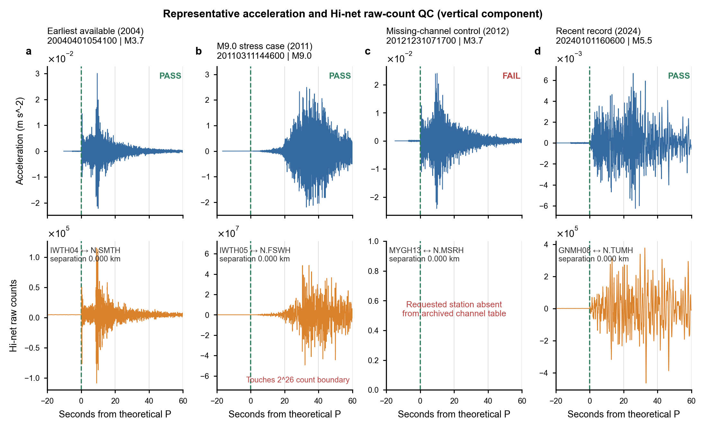
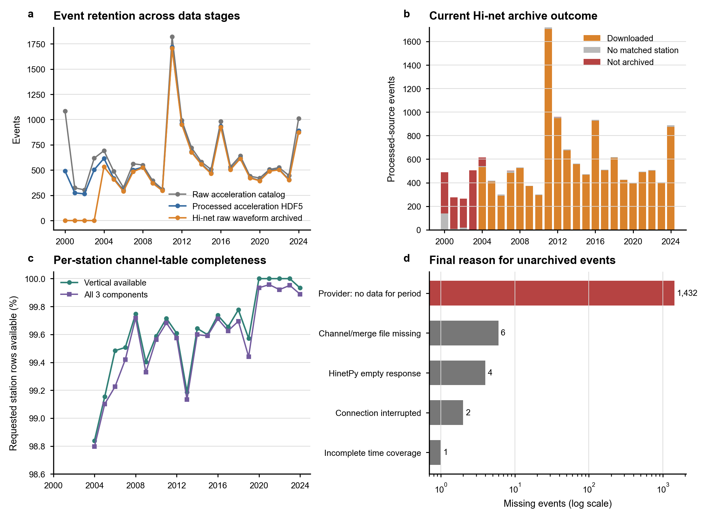

# K-NET/KiK-net 加速度与 Hi-net 速度计波形数据集审计报告

审计日期：2026-08-11（Asia/Shanghai）
审计范围：K-NET/KiK-net 原始下载目录、2000–2024 年处理后加速度 HDF5、Hi-net 年度原始字节 HDF5 归档。审计只读访问源数据，结果另存于本报告目录。

## 结论摘要

1. **加速度原始下载完整性良好。** 301 个月度目录文件共有 15,803 行、15,802 个唯一事件；磁盘上正好有 15,802 个事件 tar，共 146.23 GB。15,802/15,802 个外层 tar 均可读取并包含 K-NET 或 KiK-net 数据产品；跨 2000–2025 年按每年早、中、晚抽取的 78 个事件，其内层 `.kwin` 文件数全部与目录标注台站数一致。
2. **Hi-net 已归档波形在“文件与时间轴”层面总体正确，但数据集尚未完全闭合。** 14,153 个处理后加速度事件中，12,392 个下载到 Hi-net 原始波形，316 个没有 0.5 km 内匹配台站，1,445 个尚未归档。25 个年度归档中只有 12 个标为 complete。
3. **早年缺失主要是源站不可用，不是下载出错。** 2000–2003 年没有任何成功的 Hi-net 波形事件；日志中 1,361 个缺失事件均由 Hi-net 返回该时段无数据，另有 2002 年 2 个连接中断。2004 年 1–3 月仍有 71 个同类缺失，当前最早成功事件为 `20040401054100`。
4. **已解码抽样记录可靠。** 2004–2024 年分层抽取 63 个事件—台站样本：63/63 个事件的 CNT 和通道表哈希通过，62/63 条竖直分量可解码；可解码的 62 条均为约 100 Hz、有限值比例 100%、无缺口、无非单调时间戳，并覆盖理论 P 前后各 120 s。61 条通过全部 QC；1 条是加速度记录本身未覆盖理论 P，1 条是请求台站未出现在归档通道表。
5. **存在台站行级通道缺口。** 270,050 个请求台站行中，949 行缺竖直分量，1,086 行缺完整三分量；竖直分量完整率为 99.6486%。这些缺口影响 551/12,392 个已下载事件，说明“事件已提交”不等于“该事件的每个匹配台站均可用”。
6. **当前 Hi-net 数值是原始计数，不是已经校正的物理速度。** 下载采用 `response-mode none`，归档的是 CNT 与 `.ch` 原始字节。只有完成仪器响应/灵敏度校正后，才可将数值解释为物理速度并与加速度做振幅或频谱关系分析。

## 1. 加速度波形的筛选与下载规则

### 1.1 事件目录筛选

`get_catalog.py` 的默认查询条件为：

| 条件 | 默认值 | 本地结果中的实际范围 |
|---|---:|---:|
| 时间 | 2000-01 至 2025-01，逐月查询 | 2000-01 至 2025-01，共 301 个月 |
| 震级 | M 3–10 | M 3.0–9.0 |
| 深度 | 0–100 km | 0–100 km |
| 纬度 | 30–50°N | 30.02–47.22°N |
| 经度 | 120–150°E | 128.54–149.38°E |

代码将上述上下限提交给 K-NET/KiK-net 网页查询，没有在下载前再做本地二次筛选；上下限是否闭合由服务器搜索接口决定。从实际结果看，M 3.0、深度 0 km 和 100 km 均被保留。

目录中的每一行包含事件时间、经纬度、深度、震级、站点数和服务器 `keys`。现有目录有一个重复事件 `20161122062100`，两行分别标为 7 和 11 个站点，因此 15,803 行对应 15,802 个唯一事件。

### 1.2 波形下载筛选

`download_waveforms.py` 对目录中的事件执行以下规则：

- 按目录文件名倒序读取，即先下载较新月份；月内沿 CSV 原顺序处理。
- 事件文件名取 `keys` 的第一个逗号分隔字段，例如 `<event_id>.tar`。
- POST 请求保留完整 `keys`，并设置 `datakind=all`、`datanames=<event_id>;alldata`。
- 因此下载的是该事件服务器提供的**全部可用 K-NET/KiK-net 数据产品**，没有按台站、震中距、传感器类型、分量或网络再筛选。
- 已存在同名 tar 时直接跳过；请求间隔 1 s。

需要注意的代码风险：已有文件只按“路径存在”跳过，未校验 tar、内容类型或哈希；HTTP 401 后更新认证信息，却没有重试当前请求，理论上可能把 401 响应正文写成 tar。此次全量内容审计没有发现这种污染，但下载器本身仍应修复。

## 2. Hi-net 速度计波形的筛选与下载规则

### 2.1 事件来源

速度下载并非重新使用 15,802 个原始目录事件，而是使用处理后年度加速度 HDF5 中的 14,153 个事件。因此，原始目录中未进入处理后 HDF5 的 1,631 个事件不会被请求 Hi-net 数据。

事件参数直接读取处理后 HDF5，包括事件位置、深度、震级和 `Origin_Time(JST)`。其中 14,016 个事件有匹配后的发震时刻修正，137 个缺少该修正状态。速度下载阶段没有再次按震级、深度或区域过滤。

### 2.2 台站空间匹配

- 对处理后加速度 HDF5 中的每个 K-NET/KiK-net 台站位置，寻找水平 Haversine 距离最近的 Hi-net 台站。
- 最近距离不超过 0.5 km 才接受。
- 同一事件只请求其实际出现且通过匹配的台站；事件没有任何合格台站时，提交终态 `no_matched_stations`，不请求波形。
- 距离只表示平面坐标接近，不能保证仪器位于完全相同的场址、深度或地质条件。

### 2.3 时间窗和走时

- 理论 P 走时优先使用 JMA2001A；模型网格越界、裁剪或异常时退回 ak135。
- 每个匹配台站需要理论 P 到时前 120 s、后 120 s 的窗口。
- 同一事件的实际 Hi-net 请求覆盖所有匹配台站窗口的并集；起点向下取整到整分钟，请求分钟数向上取整。
- 使用 Hi-net 网络代码 `0101`，仅选择匹配台站。

### 2.4 存储、校验和失败处理

- 年份和事件均从新到旧处理，范围为 2024 至 2000；年度最多重试 3 次。
- 使用 `mode all`，每年一个原始字节 HDF5；不写 MiniSEED，不做仪器响应校正。
- 优先保存 HinetPy 下载的原生分钟 CNT 段及 `.ch` 通道表。当前 12,392 个成功事件均标记 `downloaded_unmerged`，原因是 HinetPy 合并步骤失败，但原生分钟段存在、时间覆盖合格且哈希验证通过；这不是波形下载失败。
- 审计时版本在提交前要求 CNT 与 `.ch` 非空，并检查整个事件请求窗在 1.1 s 容差内被覆盖。
- CNT 段和通道表保存 SHA-256；事件行最后写入作为提交标记，写入后立即读回验证。中断留下的未提交尾部可恢复。
- 审计时下载器只检查**事件全局时间覆盖**，没有在提交前确认每个请求台站及所需分量都存在于 `.ch`，这正是本次发现 949 个竖直分量缺口的原因。审计后已修改下载器：新下载及旧暂存复用均要求每个请求台站在 `.ch` 中具有 U/Z、N/1、E/2，并要求对应通道在 CNT 中实际存在且覆盖请求窗口；该改动不追溯改变已提交归档。

### 2.5 重试复核与下载器加固

针对 2005、2007、2012、2013、2016、2018、2022、2024 八个各缺一个事件的年份再次运行后，**没有新增成功事件**：已提交仍为 12,708，原始波形仍为 12,392，无匹配台站仍为 316，尚未归档仍为 1,445，complete 年份仍为 12 个。这八个事件的累计年度尝试次数由 3 增至 8，说明简单重复原请求不能解决问题。

重试失败分为两类：

- `20051115063900`（M7.1）、`20121207171800`（M7.3）、`20131026021000`（M7.1）和 `20220316233600`（M7.4）分别请求 153、161、150、168 个唯一 Hi-net 台站。HinetPy 在下载大 ZIP 时连续三次失败，旧实现最终只留下 `NoneType object is not iterable`；较可能是其内部新建下载客户端仍使用 60 s 默认超时，且根因被捕获后丢弃。
- `20070325095900`（M3.7）、`20160418033600`（M3.2）、`20180906072000`（M3.5）和 `20240101170400`（M3.8）返回了 `.ch` 通道表但没有 CNT，涉及的请求台站分别为 1、1、4、1 个，更符合提供端在该台站/时段没有连续波形，而不是响应包过大。

现已在 `tools/download_hinet_velocity.py` 和 `download_hinet.sh` 中完成以下恢复机制：默认下载超时提高到 300 s，并透传至 HinetPy 内部下载客户端；每次最多请求 40 个台站；完整窗口失败后按连续一分钟子请求回退；保留 HTTP、超时、ZIP 成员和下载字节数等根因；仅当所有台站批次、所有时间片及三分量 CNT 通道均完整时才允许事件提交。传输参数不进入 `archive_identity`，因此已有 `.partial.h5` 可直接续传。

## 3. 数据集规模与组成

### 3.1 加速度数据集

| 指标 | 结果 |
|---|---:|
| 月度目录文件 | 301 |
| 目录行 / 唯一事件 | 15,803 / 15,802 |
| 2000–2024 唯一事件 | 15,784 |
| 原始事件 tar | 15,802 |
| 原始 tar 总体积 | 146.23 GB（136.19 GiB） |
| 同时含 K-NET 与 KiK-net 产品 | 14,654 个事件 |
| 仅 K-NET / 仅 KiK-net | 941 / 207 个事件 |
| 处理后年度 HDF5 | 25 个，63.66 GB（59.29 GiB） |
| 处理后事件 | 14,153，约占 2000–2024 原始事件的 89.67% |
| 处理后台站记录 | 501,956 |
| K-NET / KiK-net 台站记录 | 211,546 / 290,410 |
| 单一地表 / KiK-net 地表 / 井下传感器 | 211,546 / 153,194 / 137,216 |

处理后事件的震级中位数为 3.9、均值为 4.036、最大为 9.0；深度中位数为 27 km。每个事件台站数中位数为 26、均值为 35.47、最大为 434。所有记录均为三分量、100 Hz、`float64` 波形；每条记录有效样本数为 4,200–56,800，中位数 12,000。物理 PGA 字段 501,956 行均存在，中位数为 0.0383 m/s²，最大为 40.22 m/s²。

逐年明细见 [`acceleration_yearly_summary.csv`](source_data/acceleration_yearly_summary.csv)，完整合并目录见 [`acceleration_catalog_combined.csv`](source_data/acceleration_catalog_combined.csv)。

### 3.2 Hi-net 速度计原始波形数据集

| 指标 | 结果 |
|---|---:|
| 源事件（处理后加速度事件） | 14,153 |
| 已提交事件 | 12,708 |
| 下载到原始波形 | 12,392（87.56%） |
| 无 0.5 km 内匹配台站 | 316（2.23%） |
| 尚未归档 | 1,445（10.21%） |
| 原始归档总体积 | 27.28 GB（25.41 GiB） |
| 成功事件请求台站行 | 270,050 |
| 竖直分量可用 / 缺失 | 269,101 / 949 |
| 三分量齐全 / 不齐全 | 268,964 / 1,086 |
| 下载事件震级 | 中位数 3.9，均值 4.025，范围 3.0–9.0 |
| 每个下载事件匹配台站数 | 中位数 17，均值 21.79，范围 1–260 |

完整年份为：2006、2008、2009、2010、2011、2014、2015、2017、2019、2020、2021、2023。

其余 13 年为 partial：2000–2005、2007、2012、2013、2016、2018、2022、2024。这里的 partial 是严格的事件集合状态；即使只缺一个事件，该年仍不会标记 complete。

未归档事件的最终原因：

| 原因 | 事件数 |
|---|---:|
| 提供端返回该时段无数据 | 1,432 |
| 通道表/合并文件缺失 | 6 |
| HinetPy 空响应 | 4 |
| 连接中断 | 2 |
| 时间覆盖不足 | 1 |

逐年明细见 [`velocity_yearly_summary.csv`](source_data/velocity_yearly_summary.csv)，全部缺失事件及最后错误见 [`velocity_missing_events.csv`](source_data/velocity_missing_events.csv)。

## 4. 速度波形正确性抽查

### 4.1 审计设计

本次复用了 `hinet_qc.sh` 所调用脚本的加速度/Hi-net 解码与 QC 函数，并扩展为三层检查：

1. **全事件/台站元数据层：** 扫描 25 个年度归档、全部 12,392 个下载事件和 270,050 个请求台站行，核对归档状态、台站距离、通道表分量和缺失原因。
2. **分层波形层：** 对 2004–2024 每年选取“最早事件的最近台站、年中事件的中位台站、最晚事件的最远台站”，共 63 条。核对 CNT 和 `.ch` 哈希、解码、有限值、采样间隔、时间单调性、缺口、理论 P 覆盖、完整前后 120 s 窗口和 0.5 km 匹配阈值。
3. **代表案例层：** 绘制最早可用 2004 年事件、2011 年 M9 压力案例、2012 年通道缺失对照、2024 年近期记录。加速度与 Hi-net 原始计数只按理论 P 对齐，不直接比较物理振幅。

### 4.2 分层抽查结果

- 63/63 个抽样事件的 CNT 与通道表 SHA-256 验证通过。
- 62/63 条竖直分量成功解码；唯一未解码样本为 `20121231071700 / MYGH13 -> N.MSRH`，其请求清单有该台站，但归档 `.ch` 中没有 `N.MSRH`。
- 62/62 条已解码记录有限值比例为 100%，采样间隔约 0.01 s，缺口数和非单调时间点均为 0，均覆盖理论 P 与完整的前后 120 s 请求窗。
- 台站匹配距离最大为 0.3898 km，全部小于 0.5 km。
- QC 为 61 PASS、2 FAIL。除上述通道缺失外，另一个 FAIL 为 `20041231173000 / KSRH07 -> N.TRSH`：Hi-net 波形正常，但理论 P 位于加速度有效记录之外，属于加速度侧覆盖问题。
- 已解码样本中，P 后 0–30 s 与 P 前 -20 至 -1 s 的 Hi-net 原始计数 RMS 比值最小为 2.11、中位数为 160.0，说明抽样记录均出现清晰的事件后能量增长；该指标只用于时序正确性检查，不代表物理速度标定正确。
- 最终加速度 P pick 相对 Hi-net 理论 P 的偏差中位数为 -0.023 s，95% 分位数为 0.421 s；存在最大 +26.405 s 的源 pick 异常值，后续训练时应单独过滤。

抽样逐行指标见 [`velocity_qc_samples.csv`](source_data/velocity_qc_samples.csv)，全部通道缺口见 [`velocity_channel_gaps.csv`](source_data/velocity_channel_gaps.csv)。

### 4.3 早年数据与代表案例

| 年份 | 源事件 | 下载成功 | 无匹配台站 | 未归档 | 解释 |
|---:|---:|---:|---:|---:|---|
| 2000 | 490 | 0 | 140 | 350 | 350 个均为提供端无数据 |
| 2001 | 275 | 0 | 8 | 267 | 267 个均为提供端无数据 |
| 2002 | 264 | 0 | 19 | 245 | 243 个提供端无数据，2 个连接中断 |
| 2003 | 504 | 0 | 3 | 501 | 501 个均为提供端无数据 |
| 2004 | 616 | 534 | 8 | 74 | 71 个提供端无数据；最早成功于 4 月 1 日 |

2004 年最早成功案例 `20040401054100 / IWTH04 -> N.SMTH` 的 Hi-net 波形能正确解码、覆盖请求窗，并在理论 P 后出现清晰能量增长，说明 2004 年可获得部分可靠数据。2000–2003 年则不应描述为“低质量波形”，因为当前根本没有成功下载到波形；应明确标为提供端不可用。

2011 年 M9 事件 `20110311144600 / IWTH05 -> N.FSWH` 在时间轴和归档完整性上 PASS，但原始计数最小值恰为 `-67,108,864 = -2^26`，应标为可能触及数字量程边界/饱和压力案例。它不是下载错误，但在物理幅值研究中不能无条件使用。

代表波形图：



矢量版：[SVG](figures/representative_waveform_qc.svg) · [PDF](figures/representative_waveform_qc.pdf)；绘图源数据见 [`representative_waveform_source.csv`](source_data/representative_waveform_source.csv)，案例指标见 [`representative_case_summary.csv`](source_data/representative_case_summary.csv)。

## 5. 数据覆盖与缺失结构图



图 a 对比原始加速度目录、处理后加速度 HDF5 和已归档 Hi-net 波形事件；图 b 显示下载、无匹配台站和未归档事件；图 c 是逐年通道表完整率；图 d 是未归档原因。矢量版：[SVG](figures/dataset_coverage_overview.svg) · [PDF](figures/dataset_coverage_overview.pdf)。

## 6. 使用边界与建议

### P0：在正式使用速度数据集前必须执行

1. 生成台站行级可用性掩码，至少要求 `vertical_available=1`；三分量任务要求 `three_components_available=1`。不要只用事件级 `raw_status` 判断样本可用。
2. 需要物理速度时，使用归档 `.ch` 中的灵敏度/响应信息完成响应去除，并保存单位、处理参数和质量标记。当前 raw counts 不应直接与 m/s² 加速度比较振幅。
3. 将速度数据的事实起始时间定义为 **2004-04-01**；2000–2003 和 2004 年一季度按“提供端不可用”处理，避免无限重试或误判为低质量波形。

### P1：完善下载与质量控制

1. 新下载的提交前台站/三分量通道与 CNT 样点覆盖校验已实现；对已提交的 551 个受通道缺口影响事件仍需使用审计生成的台站级可用性掩码，或另建修复归档，不能原地改写。
2. 使用新的分批/分钟回退机制再次重试 13 个非“提供端无数据”的技术失败事件；对长期无数据事件设置可审计的终态/排除清单，使年度 complete 的含义与数据可获得性策略一致。
3. 对极值恰好触及固定数字边界、零值过多、极值重复或异常能量比的记录增加饱和/坏道标记。
4. 将 `downloaded_unmerged` 更名或解释为 `downloaded_native_segments`，避免把可用的原生分钟段误认为失败。

### P2：改进加速度下载器

1. HTTP 401 后必须用新凭据重试当前事件；写文件前检查状态码、内容类型和 tar 可读性，完成后保存 SHA-256 清单。
2. 已存在文件不能仅按路径跳过，应先做最小完整性验证。
3. 目录合并前按事件 ID 去重，并记录重复元数据冲突，例如 `20161122062100` 的站点数冲突。

## 7. 审计限制

- 15,802 个加速度外层 tar 已全量打开；内层 `.kwin` 是按每年 3 个事件抽样，共 78 个，并非全量展开。
- Hi-net 的事件状态与通道表已全量检查；波形样点解码是 63 条分层抽样，不等同于解码全部 12,392 个事件。
- 本审计验证下载内容、哈希、时间轴、窗口和事件后能量，不验证 Hi-net 仪器响应标定后的绝对物理速度。
- K-NET/KiK-net 与 Hi-net 是不同仪器、不同场址条件；即使距离小于 0.5 km，也不应期待波形振幅或高频细节完全一致。

## 8. 可复现文件

- 审计脚本：[`tools/audit_acceleration_hinet_datasets.py`](../../tools/audit_acceleration_hinet_datasets.py)
- 汇总指标：[`dataset_summary.csv`](source_data/dataset_summary.csv)
- 审计参数与路径：[`audit_provenance.json`](audit_provenance.json)
- 原始加速度 tar 全量检查：[`acceleration_tar_outer_qc.csv`](source_data/acceleration_tar_outer_qc.csv)
- 加速度内层抽查：[`acceleration_tar_nested_sample_qc.csv`](source_data/acceleration_tar_nested_sample_qc.csv)
- 速度缺失事件：[`velocity_missing_events.csv`](source_data/velocity_missing_events.csv)
- 速度通道缺口：[`velocity_channel_gaps.csv`](source_data/velocity_channel_gaps.csv)
- 速度分层波形 QC：[`velocity_qc_samples.csv`](source_data/velocity_qc_samples.csv)

复现命令：

```bash
python -u tools/audit_acceleration_hinet_datasets.py --validate-all-tars
```
