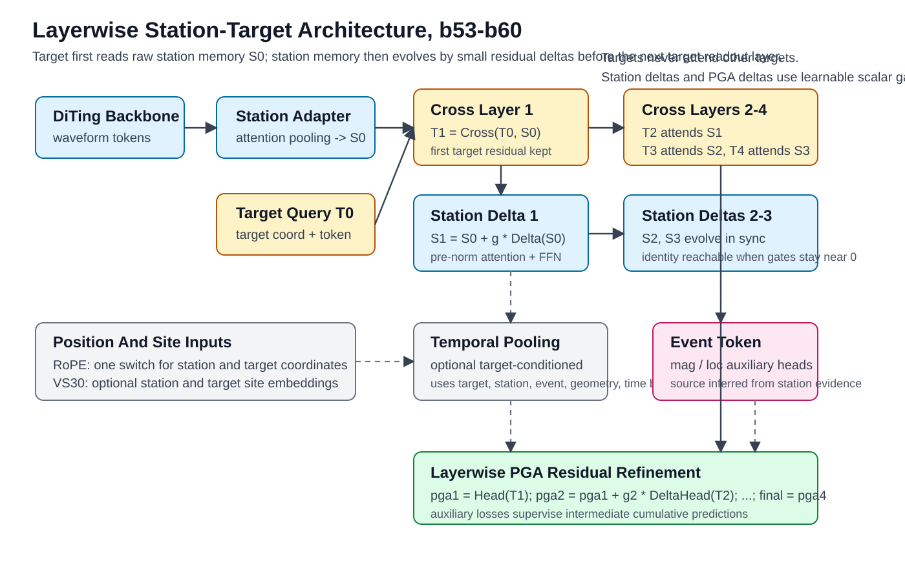
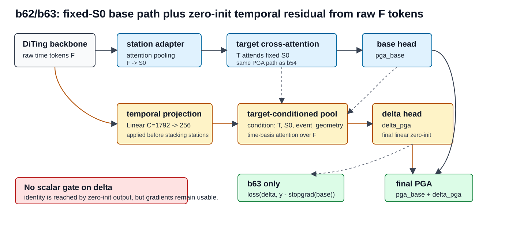

# Stage2 512 Layerwise Station-Target Architecture Plan

Date: 2026-05-26
Updated: 2026-06-06

This report records the new branch architecture after the `pos-r1` to `pos-r8`
results showed that replacing or heavily transforming the DiTing station memory
hurts train fit. The goal is to test a stronger station-target co-evolution
model while keeping the old b43/pos-r anchor exactly reproducible.

## Code Provenance

Historical configs and results up to the completed `pos-a` to `pos-f` and
`pos-r1` to `pos-r8` experiments should be reproduced from this code commit:

```text
f86f4a58b14780b66a91507bb1c3e94973140c45
Update strict VS30 Japan rebuild diagnostics
```

That commit is on branch `zhangb/diting-backbone-attnpool-team`. The new
architecture work is on branch:

```text
zhangb/layerwise-station-temporal
```

The new branch intentionally does not preserve every old configuration behavior
as a design constraint. For old-result reproduction, use the commit above.

## Architecture



The new path is `station_context_mode=layerwise_station_target`.

Main sequence:

```text
T1 = Cross_1(T0, S0)
S1 = S0 + g_s1 * DeltaStation_1(S0)

T2 = Cross_2(T1, S1)
S2 = S1 + g_s2 * DeltaStation_2(S1)

T3 = Cross_3(T2, S2)
S3 = S2 + g_s3 * DeltaStation_3(S2)

T4 = Cross_4(T3, S3)
```

Important details:

- The first target cross-attention layer reads raw DiTing station memory `S0`.
  This keeps the strongest existing path reachable.
- Station updates are pre-norm residual deltas:
  `S = S + gate_attn * SelfAttn(LN(S))`, then
  `S = S + gate_ffn * FFN(LN(S))`.
- There is one station-delta gate family, not separate `gate` and `gamma`
  scalars.
- Targets never attend other targets.
- `use_rope=true` is still a single switch and applies to both station and
  target coordinate systems.
- The optional temporal branch performs target-conditioned pooling over DiTing
  time tokens using target query, station memory, event latent, station/target
  geometry, and a learned time basis.

## b53-b60 Result Summary

The completed `b53` to `b60` results changed the interpretation of the first
layerwise plan:

- `b53` is the new-branch fixed-`S0` anchor and is effectively the b43-style
  fixed-station-memory path under the new code.
- `b54` adds low-weight event mag/loc auxiliary losses while keeping the PGA
  forward path the same as `b53`; this remains the best anchor for the next
  temporal-residual tests.
- `b55` adds layerwise PGA residual refinement but does not add new station
  information. The residual heads barely open, so it does not improve over
  `b54`.
- `b56` transforms `S0` through station-delta blocks. The results show that
  this currently disrupts the useful DiTing station memory rather than exposing
  better features.
- `b57` combines station delta and layerwise PGA residual refinement and is
  worse than the anchor. It should not be used as the base for further
  temporal/RoPE/VS30 tests.
- `b58` to `b60` did not produce valid full-model results. They should be
  treated as memory/implementation failures of the old full temporal path, not
  as evidence against temporal information.

The key design correction is to keep the b54 PGA path intact and add a separate
raw-token residual branch, instead of placing temporal pooling on top of the
already-failing `b57` path.

## Temporal Residual Branch

The first `b58` to `b60` configs attempted target-conditioned temporal pooling
directly on DiTing time tokens with shape:

```text
X: B x S x L x C, C = 1792
```

That path hit HIP OOM inside `TargetConditionedTemporalPool` while stacking and
normalizing the full token tensor. Even the later `b58_c256` style is not the
right scientific comparison, because it is still built on the poor `b57`
station-delta/layerwise-PGA base.

The new `b62` and `b63` configs instead use this structure:

```text
base path:       F -> station adapter -> S0 -> target cross-attention -> pga_base
residual path:   F -> Linear(1792,256) -> target-conditioned temporal pool -> delta_pga
final output:    pga_base + delta_pga
```



Important implementation details:

- The temporal channel projection is applied per station before stacking across
  stations, so the raw `B x S x L x 1792` activation is not materialized.
- There is no learnable scalar gate on `delta_pga`. The branch is initialized as
  identity by zero-initializing the final `delta_pga` projection, which keeps
  gradients usable.
- `b62` trains only on the final PGA output.
- `b63` uses the same forward graph as `b62`, but adds an auxiliary residual
  loss: `loss(delta_pga, y - stopgrad(pga_base))`.
- `b64` to `b67` are the parallel queue for the same memory scale: no smaller
  batch, no smaller hidden dimension, and no reduced-token variant beyond the
  fixed temporal projection needed by the residual branch.
- The single-station pretrain model is identical for `b62` to `b67` and `b54`.
  These configs therefore skip `single_station_pretrain` and load:
  `weights_japan_overfit_pga15_stage2_512_b54_event_aux/single_station_best.pth`.
  If that checkpoint is not present on the server, copy it into the run
  directory or update `training_params.station_pretrain_path` to the existing
  equivalent checkpoint before launch.

The completed `b62` to `b67` results did not prove that the raw-token temporal
residual path is useful. The residual output stayed extremely small: the final
`delta_abs_mean` was only about `0.0065` to `0.0109` in normalized PGA units,
roughly `0.0038` to `0.0063` in unnormalized log-PGA units with the current
training normalization. This is only about `0.7%` to `1.2%` of the base output
scale. The observed metric differences are therefore more likely caused by
training perturbations and auxiliary-loss regularization than by a meaningful
correction learned from raw `F`.

## Frozen-Base Temporal Diagnostic Experiments

The next diagnostic step is to stop the b54 base path from absorbing the error.
Configs `b68` to `b71` load:

```text
weights_japan_overfit_pga15_stage2_512_b54_event_aux/full_model_best.pth
```

through `training_params.transfer_model_path`, freeze every parameter except
`pga_temporal_residual_head`, and train PGA only. They also use
`training_params.lr_pga_temporal_residual=0.005`, so the residual head receives
a dedicated learning-rate group.

New code switches used by these configs:

- `training_params.freeze_mode=temporal_residual_only` freezes the transferred
  base path, keeps frozen submodules in eval mode during training, and leaves
  only the raw-token residual branch trainable.
- `model_params.pga_temporal_residual_mode=residual` keeps the original
  `pga_final = pga_base + delta_pga` form.
- `model_params.pga_temporal_residual_mode=absolute` makes the temporal branch
  predict PGA directly; diagnostics still report
  `delta_pga = pga_temporal_pred - stopgrad(pga_base)`.
- `model_params.pga_temporal_residual_token_control=station_roll` rolls raw
  temporal tokens across stations inside each event before the residual branch
  and is used as the b71 negative control.
- `eval_checkpoint.py` now writes `pga_temporal_base`,
  `pga_temporal_delta`, `pga_temporal_pred`, and `pga_temporal_final` into the
  result npz when the branch exists, and prints
  `corr(delta, label-base)`.

The first-pass success criteria are:

- `delta_abs_mean` should rise well above the b62-b67 level, ideally above
  `0.05` normalized PGA units.
- Train-set `corr(delta, label-base)` should be clearly positive.
- `pga_temporal_final` should improve train MAE over `pga_temporal_base`.
- If b71 approaches b68, the apparent gain is not specific to correctly matched
  raw temporal tokens `F`.

## Realtime MDN Raw-Token Bypass Diagnostics

The rt20-rt25 collapse follow-up showed that station-adapter output remains
highly similar across stations. A remaining question is whether the collapse is
already present in the DiTing encoder output `F` before the station adapter, or
whether the station adapter/readout path compresses distinct raw tokens into an
event-common representation.

Two code changes target this question:

- `eval_checkpoint.py::diagnose_diting_features` now reports inter-station
  cosine for 3D tensor outputs, including flat cosine, GAP over the last axis,
  GAP over the penultimate axis, and per-token cosine summaries. For the normal
  DiTing encoder output shape `S x C x T`, module `0` now gives a direct
  pre-adapter collapse diagnostic instead of only printing L2 norms.
- `use_pga_temporal_residual=true` now also supports `output_distribution=mdn`
  and `gaussian` for PGA. The temporal residual head predicts a point
  `delta_pga`; for distributional PGA heads, the model shifts every mixture
  component mean by this delta while leaving mixture weights and sigmas intact.
  The saved temporal diagnostics record point-level `base`, `delta`, and
  `final` means so `corr(delta, label-base)` remains well-defined.

Configs rt26-rt29 use the realtime rt10 MDN anchor rather than the older point
output b54 anchor. They load:

```text
weights_japan_overfit_pga15_stage2_512_rt10_b54_realtime_pga_mdn3_mag_gaussian_loc_mdn3_meanaux010/full_model_best.pth
```

through `training_params.transfer_model_path`, freeze the transferred base path
with `training_params.freeze_mode=temporal_residual_only`, and train only
`pga_temporal_residual_head`. This makes the diagnostic causal: the base model
cannot absorb the residual, so any improvement must come through the raw-token
bypass head or through its non-waveform conditioning.

| Exp | Purpose | Key switches | Config |
|---|---|---|---|
| rt26 | Matched raw-token bypass on frozen rt10 MDN base | `token_control=none`, readout query, readout station attention | `pga_configs/transformer_japan_overfit_pga15_stage2_512_rt26_rt10anchor_mdn_rawtoken_frozen_residual_chaosuan.json` |
| rt27 | Negative control for station-token matching | rt26 + `token_control=station_roll` | `pga_configs/transformer_japan_overfit_pga15_stage2_512_rt27_rt10anchor_mdn_rawtoken_stationroll_control_chaosuan.json` |
| rt28 | Negative control for raw waveform-token content | rt26 + `token_control=zero` | `pga_configs/transformer_japan_overfit_pga15_stage2_512_rt28_rt10anchor_mdn_rawtoken_zero_control_chaosuan.json` |
| rt29 | More independent matched-token branch | matched tokens + `query_source=target_query`, `station_weighting=uniform`, no event context | `pga_configs/transformer_japan_overfit_pga15_stage2_512_rt29_rt10anchor_mdn_rawtoken_independent_query_uniform_chaosuan.json` |

Interpretation should prioritize the diagnostic quantities over ordinary final
PGA ranking:

- rt26 is useful only if `pga_temporal_final` improves over
  `pga_temporal_base`, `delta_abs_mean` is non-trivial, and
  `corr(delta, label-base)` is clearly positive on train and not destroyed on
  validation.
- rt27 close to rt26 means the apparent gain does not require correctly matched
  station tokens, so it is not evidence that raw `F` carries usable station
  specificity.
- rt28 close to rt26 means the branch can learn the same correction from query,
  coordinate, attention, or event priors without waveform tokens.
- rt29 beating rt26 suggests the original residual branch was too coupled to
  the base readout/attention path. rt29 also still needs to beat rt27/rt28 to
  count as evidence for raw-token usefulness.
- If module `0` cosine from `eval_checkpoint.py` is already near 1.0 across
  flat, GAP, and token-wise summaries, then collapse likely occurs inside the
  frozen DiTing encoder or in the current event/window setup before the station
  adapter. If module `0` is diverse but module `1` is near 1.0, the adapter is
  the main compression point.

## Layerwise PGA Refinement

When `pga_layerwise_refinement=true`, each target readout layer contributes a
cumulative PGA estimate:

```text
pga1 = Head_1(T1)
pga2 = pga1 + gate_2 * DeltaHead_2(T2)
pga3 = pga2 + gate_3 * DeltaHead_3(T3)
pga4 = pga3 + gate_4 * DeltaHead_4(T4)
```

The final output is `pga4`. Configs with layerwise refinement also enable an
auxiliary loss on the intermediate cumulative estimates with weights
`[0.1, 0.1, 0.2]`. This tests whether later layers can act as stable residual
corrections rather than forcing all useful information into `S0`.

## Event Auxiliary Head

The model already produces event magnitude and location heads when event tokens
are enabled. The new configs use them as low-weight auxiliary supervision:

```json
"res_comps": ["mag", "loc", "pga"],
"res_weight": [0.02, 0.02, 1.0]
```

The event representation is inferred from station evidence. Source coordinates
are not fed as teacher-forced inputs to the PGA readout.

## Generated Experiment Matrix

The configs are JSON files and can be launched with the unchanged single-job
interface:

```bash
bash train_light_slurm.sh pga_configs/<config>.json
```

| Exp | Purpose | Key switches | Config |
|---|---|---|---|
| b53 | New-branch anchor; fixed `S0`, PGA-only loss | `station_context_mode=off`, no new losses | `pga_configs/transformer_japan_overfit_pga15_stage2_512_b53_branch_anchor_pga_only_chaosuan.json` |
| b54 | Test event mag/loc auxiliary loss alone | b53 + `res_comps=[mag,loc,pga]` | `pga_configs/transformer_japan_overfit_pga15_stage2_512_b54_event_aux_chaosuan.json` |
| b55 | Test layerwise PGA residual refinement on fixed `S0` | b54 + `pga_layerwise_refinement=true` | `pga_configs/transformer_japan_overfit_pga15_stage2_512_b55_event_aux_layerpga_chaosuan.json` |
| b56 | Test small-gated station delta path | b54 + `station_context_mode=layerwise_station_target` | `pga_configs/transformer_japan_overfit_pga15_stage2_512_b56_event_aux_stationdelta_chaosuan.json` |
| b57 | Test station deltas plus layerwise PGA refinement | b56 + `pga_layerwise_refinement=true` | `pga_configs/transformer_japan_overfit_pga15_stage2_512_b57_event_aux_stationdelta_layerpga_chaosuan.json` |
| b58 | Test target-conditioned temporal pooling | b57 + `use_target_temporal_pooling=true` | `pga_configs/transformer_japan_overfit_pga15_stage2_512_b58_event_aux_stationdelta_layerpga_temporal_chaosuan.json` |
| b59 | Test synchronized station/target RoPE on the full core path | b58 + `use_rope=true` | `pga_configs/transformer_japan_overfit_pga15_stage2_512_b59_event_aux_stationdelta_layerpga_temporal_rope_chaosuan.json` |
| b60 | Test VS30 after the full core path is enabled | b59 + `use_vs30=true` | `pga_configs/transformer_japan_overfit_pga15_stage2_512_b60_event_aux_stationdelta_layerpga_temporal_rope_vs30_chaosuan.json` |
| b58_c256 | Superseded memory-fix attempt on the old b57 base | b58 + `temporal_token_dim=256` | `pga_configs/transformer_japan_overfit_pga15_stage2_512_b58_c256_event_aux_stationdelta_layerpga_temporal_chaosuan.json` |
| b59_c256 | Superseded RoPE follow-up on the old b57 base | b59 + `temporal_token_dim=256` | `pga_configs/transformer_japan_overfit_pga15_stage2_512_b59_c256_event_aux_stationdelta_layerpga_temporal_rope_chaosuan.json` |
| b60_c256 | Superseded VS30 follow-up on the old b57 base | b60 + `temporal_token_dim=256` | `pga_configs/transformer_japan_overfit_pga15_stage2_512_b60_c256_event_aux_stationdelta_layerpga_temporal_rope_vs30_chaosuan.json` |
| b62 | Test raw-`F` temporal residual beyond the b54 fixed-`S0` path | b54 + `use_pga_temporal_residual=true`, no residual aux loss | `pga_configs/transformer_japan_overfit_pga15_stage2_512_b62_event_aux_temporal_residual_chaosuan.json` |
| b63 | Test whether explicit residual supervision opens the `delta_pga` branch | b62 + `pga_temporal_residual_loss.enabled=true` | `pga_configs/transformer_japan_overfit_pga15_stage2_512_b63_event_aux_temporal_residual_aux_chaosuan.json` |
| b64 | Test stronger residual supervision | b63 + residual aux weight `0.5` | `pga_configs/transformer_japan_overfit_pga15_stage2_512_b64_event_aux_temporal_residual_auxw05_chaosuan.json` |
| b65 | Test whether residual branch should reuse base station attention | b63 + `pga_temporal_residual_station_weighting=uniform` | `pga_configs/transformer_japan_overfit_pga15_stage2_512_b65_event_aux_temporal_residual_aux_uniformsta_chaosuan.json` |
| b66 | Test whether residual branch should use final target state or raw target query | b63 + `pga_temporal_residual_query_source=target_query` | `pga_configs/transformer_japan_overfit_pga15_stage2_512_b66_event_aux_temporal_residual_aux_targetq_chaosuan.json` |
| b67 | Test most independent temporal residual branch | b63 + raw target query + uniform station pooling | `pga_configs/transformer_japan_overfit_pga15_stage2_512_b67_event_aux_temporal_residual_aux_targetq_uniformsta_chaosuan.json` |
| b68 | Force the residual branch to open against a fixed b54 base | load b54-best, `freeze_mode=temporal_residual_only`, residual aux weight `1.0` | `pga_configs/transformer_japan_overfit_pga15_stage2_512_b68_event_aux_temporal_residual_warmup_chaosuan.json` |
| b69 | Check whether zero initialization is blocking the branch | b68 + `pga_temporal_residual_zero_init=false` | `pga_configs/transformer_japan_overfit_pga15_stage2_512_b69_event_aux_temporal_residual_warmup_nozeroinit_chaosuan.json` |
| b70 | Check whether predicting absolute PGA is easier than predicting residual PGA | fixed b54 base, `pga_temporal_residual_mode=absolute`, no residual aux loss | `pga_configs/transformer_japan_overfit_pga15_stage2_512_b70_event_aux_temporal_absolute_warmup_chaosuan.json` |
| b71 | Negative control for correctly matched raw temporal tokens | b68 + `pga_temporal_residual_token_control=station_roll` | `pga_configs/transformer_japan_overfit_pga15_stage2_512_b71_event_aux_temporal_residual_warmup_stationroll_chaosuan.json` |

## How To Interpret Results

Use adjacent comparisons, not just absolute validation MAE:

- b53 vs pos-r1: checks that the new branch has not changed the anchor path.
- b54 vs b53: event auxiliary supervision effect.
- b55 vs b54: whether layerwise PGA residual refinement helps without station
  memory updates.
- b56 vs b54: station-delta effect without layerwise PGA residuals.
- b57 vs b56 and b57 vs b55: whether station deltas and PGA deltas cooperate.
- b58 to b60: record them as old temporal-token memory/implementation failures
  on a poor b57 base.
- b58_c256 to b60_c256: superseded; do not prioritize unless a historical
  comparison is explicitly needed.
- b62 vs b54: whether raw DiTing time tokens `F` contain useful PGA residual
  information beyond the adapter-compressed `S0`.
- b63 vs b62: whether explicit residual supervision helps the zero-init
  `delta_pga` branch become active.
- b64 vs b63: whether the residual branch only needs stronger residual-target
  supervision to become useful.
- b65 vs b63: whether reusing the base readout station attention constrains the
  temporal branch too much.
- b66 vs b63: whether the temporal branch should be conditioned on final target
  state `T4` or the original target query `T0`.
- b67 vs b63/b65/b66: whether a more independent temporal branch is better than
  a branch tightly coupled to the base readout.
- b68: decisive check that the raw-token residual head can reduce fixed-base
  PGA error at all.
- b69 vs b68: whether the previous failure to open was caused by the zero-init
  final residual projection.
- b70 vs b68/b69: whether the branch learns better when asked to predict
  absolute PGA first instead of a small residual.
- b71 vs b68: negative control for whether gains require correctly matched
  temporal tokens `F`.

Always report train MAE, validation MAE, slope, prediction standard deviation,
strong-PGA bias for `label >= -1.0`, weak-bin bias, and gate diagnostics:
station delta gates, PGA delta gates, temporal residual `delta_abs_mean`,
temporal entropy, VS30 gates, and readout gates. For `b68` to `b71`, also
report `pga_temporal_base` MAE, `pga_temporal_final` MAE, `|delta|` mean, and
`corr(delta, label-base)` from the eval npz.

## rt30-rt39: DPK/Eventness Token-Prior Plan

Updated: 2026-06-08

The next question is whether the apparent station-feature collapse is caused by
pooling over long padded/no-signal regions. The key hypothesis is:

```text
DiTing encoder features may still differ across stations at token level,
but global pooling / station adapter / residual readout can average them into
event-common vectors if most tokens are padding or low-information context.
```

The new code adds soft token priors, not fixed topK. Fixed topK is deliberately
removed because the useful token count is time-dependent: early warning windows
should use few high-confidence tokens, while later windows can use more tokens.
Instead, the analysis records `effective_token_count = exp(entropy)` for the
learned attention after any prior is applied.

DPK loading policy:

- DPK checkpoint path is fixed in configs:
  `/public/home/test_bigmodel/seismogram/mx/ckpt/1200m_dpk/mae_init/720w_sft/model-4-latest.pth`.
- The DPK checkpoint is a standalone `ViTAdapter + DPK head` checkpoint.
- On model construction, compare the current MAE encoder against the DPK
  encoder. If all encoder tensors match exactly, keep only the current encoder
  and reuse the DPK head. If not, keep a second frozen DPK model in memory.
- The result is recorded in diagnostics:
  `diag/dpk_encoder_all_equal`, `diag/dpk_encoder_shared`,
  `diag/dpk_encoder_common_tensors`, `diag/dpk_encoder_equal_tensors`,
  `diag/dpk_encoder_max_abs_diff`, plus load missing/unexpected counts.

DPK eventness policy:

- Default DPK prior uses `det` / event only.
- `ppk` and `spk` are sparse peak channels, so they are not mixed by default.
- `dpk_all` is a controlled comparison using `max(det, ppk, spk)`.

The new configs force `diting_frontend=vit_adapter` so that f2/f3/f4/x are
available. They transfer rt10-best TEAM-side weights but exclude
`waveform_model.*`, because rt10 was run through the backbone-attention-pool
front end and the station adapter is not shape-compatible.

| Exp | Purpose | Key switches | Config |
|---|---|---|---|
| rt30 | Diagnostic run for DPK encoder consistency and f2/f3/f4/x token-prior logging | `station_token_weight_mode=dpk_event`, 1 epoch | `pga_configs/transformer_japan_overfit_pga15_stage2_512_rt30_dpk_event_partition_diagnostic_chaosuan.json` |
| rt31 | Oracle upper bound for station adapter pooling | `station_token_weight_mode=oracle_nonzero` | `pga_configs/transformer_japan_overfit_pga15_stage2_512_rt31_oracle_nonzero_station_pool_chaosuan.json` |
| rt32 | Oracle upper bound for PGA temporal residual | `temporal_token_weight_mode=oracle_nonzero`, `use_pga_temporal_residual=true` | `pga_configs/transformer_japan_overfit_pga15_stage2_512_rt32_oracle_nonzero_temporal_residual_chaosuan.json` |
| rt33 | Deployable non-DPK prior baseline | `station_token_weight_mode=energy` | `pga_configs/transformer_japan_overfit_pga15_stage2_512_rt33_energy_station_pool_chaosuan.json` |
| rt34 | Primary DPK event-only station pooling test | `station_token_weight_mode=dpk_event` | `pga_configs/transformer_japan_overfit_pga15_stage2_512_rt34_dpk_event_station_pool_chaosuan.json` |
| rt35 | Test whether sparse ppk/spk help station pooling | `station_token_weight_mode=dpk_all` | `pga_configs/transformer_japan_overfit_pga15_stage2_512_rt35_dpk_all_station_pool_chaosuan.json` |
| rt36 | vit_adapter learned-pooling baseline | `station_token_weight_mode=learned`, no external prior | `pga_configs/transformer_japan_overfit_pga15_stage2_512_rt36_learned_vit_station_pool_baseline_chaosuan.json` |
| rt37 | DPK event-only prior in temporal residual only | `temporal_token_weight_mode=dpk_event`, `use_pga_temporal_residual=true` | `pga_configs/transformer_japan_overfit_pga15_stage2_512_rt37_dpk_event_temporal_residual_chaosuan.json` |
| rt38 | DPK all-task prior in temporal residual only | `temporal_token_weight_mode=dpk_all`, `use_pga_temporal_residual=true` | `pga_configs/transformer_japan_overfit_pga15_stage2_512_rt38_dpk_all_temporal_residual_chaosuan.json` |
| rt39 | Strongest event-only combined path | `station_token_weight_mode=dpk_event`, `temporal_token_weight_mode=dpk_event`, temporal residual on | `pga_configs/transformer_japan_overfit_pga15_stage2_512_rt39_dpk_event_station_pool_temporal_residual_chaosuan.json` |

How to analyze this group:

- First read rt30 diagnostics. If `dpk_encoder_all_equal=1`, future work can
  stop checking encoder identity and can assume one shared encoder plus DPK head
  is enough. If it is 0, DPK experiments used two frozen encoders.
- For feature collapse, do not only compare final PGA MAE. Use
  `eval_checkpoint.py` feature diagnostics for module `0` list outputs
  f2/f3/f4/x and module `1` station adapter output. Report flat cosine, GAP
  cosine, token-wise mean/std/min/max, and whether collapse starts before or
  after the station adapter.
- Compare rt31 vs rt36. If oracle nonzero station pooling helps substantially,
  padded/no-signal tokens are a real pooling problem. If it does not, the main
  issue is probably not simple zero padding.
- Compare rt32 vs rt36. If oracle temporal residual helps but rt31 does not,
  raw temporal tokens contain useful PGA information but station embedding
  pooling still loses it.
- Compare rt34 vs rt31 and rt37 vs rt32. These are the practical versions of
  the oracle checks. DPK eventness is useful only if it moves in the same
  direction as the oracle without large overfitting.
- Compare rt35 vs rt34 and rt38 vs rt37. If all-task is worse or less stable,
  keep event-only and do not mix ppk/spk by default.
- Compare rt39 vs rt34/rt37. This checks whether filtering before station
  pooling and filtering during target-conditioned temporal readout are
  complementary.

Required reported metrics:

- Train and validation metrics for PGA, magnitude, and location. The station
  pooling variants change the shared station representation, so mag/loc must be
  tracked even if PGA is the main target.
- Feature-collapse diagnostics:
  `raw_station_emb_cosine_mean`, `wave_station_emb_cosine_mean`,
  `station_emb_cosine_mean`, module `0` f2/f3/f4/x cosine summaries, and module
  `1` station adapter cosine summaries.
- Token-prior diagnostics:
  `station_pool_*_effective_token_count`,
  `station_pool_*_prior_effective_token_count`,
  `pga_temporal_effective_token_count`,
  `pga_temporal_prior_effective_token_count`,
  `pga_temporal_prior_mean/std`.
- For temporal residual configs, also report `pga_temporal_base` MAE,
  `pga_temporal_final` MAE, `pga_temporal_delta_abs_mean`,
  `pga_temporal_delta_std`, and `corr(delta, label-base)`.
