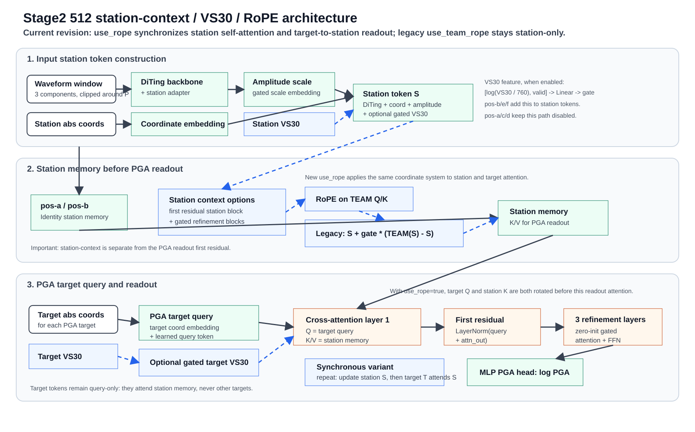

# Stage2 512 Position-Information Experiment Plan: VS30 + RoPE

Date: 2026-05-23
Updated: 2026-05-25

This plan follows the b43/b43_clean stage2 anchor. The next question is whether
location/site information improves the mechanism or only memorizes seen
station/location priors.

## Current Anchors

- Legacy clean mechanism anchor: b19 `pga_norm_amp_abs_add`.
- Legacy strong-PGA reference: b29-last `pga_norm_amp_pga08_strongw2`.
- Current structure anchor: b43 `pga_norm_amp_pga08_strongw2_xattn4_gate0_firstres`.
- Clean-data balanced anchor: b43_clean best in
  `weights_japan_overfit_pga15_stage2_512_b43_pga_norm_amp_pga08_strongw2_xattn4_gate0_firstres_new`.

## Key Code Caveat

b19/b29 use:

```json
"pga_readout_mode": "target_cross_attention",
"event_readout_mode": "event_cross_attention"
```

In this path, PGA readout cross-attends directly to `station_feature_emb`. The
TEAM self-attention transformer is not run before PGA prediction. Therefore,
adding RoPE only inside `MultiHeadSelfAttention` would not affect b19/b29 PGA
outputs unless the station tokens are explicitly contextualized before readout.

The RoPE experiment must therefore include a station-context control. The raw
`transformer_pre_readout` path collapsed in b41/b47, and the first smoke pass
showed that legacy gated context barely opened. The default control for the
next pass should be the station first-residual path:

```text
station_context_mode = off/current
station_context_mode = firstres_transformer_pre_readout, use_rope = false
station_context_mode = firstres_transformer_pre_readout, use_rope = true
station_context_mode = synchronous_station_target, use_rope = true
```

Do not compare current b43 directly against station-context + RoPE and interpret
the whole delta as RoPE.

## Implementation Status (2026-05-25)

VS30 source and data:

- Source: J-SHIS Mesh Search API, field `AVS` (30 m average S-wave velocity).
- Downloader: `tools/download_japan_vs30.py`.
- Downloaded station table:
  `resources/vs30/japan_vs30_jshis_station_cache.csv`.
- Coverage: 1489 unique station-coordinate rows, 1483 valid VS30 values.
- Missing rows: 6 KNG20x island/near-offshore stations returned J-SHIS 404 at
  1 km radius and are represented by `vs30_valid=0`.

HDF5 construction:

- `build_japan_training_data.py` accepts `--vs30_csv`,
  `--vs30_max_distance_km`, and `--require_vs30`.
- `japan_dataset_builder.py` writes station-aligned `vs30`, `vs30_valid`,
  `vs30_query_distance_km`, `vs30_source`, `vs30_mesh_code`, and
  `vs30_match_method` datasets when `--vs30_csv` is provided.
- Default behavior is non-destructive: missing VS30 stays masked. Use
  `--require_vs30` only for a strict ablation that drops stations without VS30.

Training/model:

- Generator switch: `model_params.use_vs30=true` makes
  `PreloadedEventGenerator` append station and target VS30 tensors after
  `pga_target_valid`; old configs keep the previous input layout.
- Model switch: `use_vs30=false` by default. When enabled, station and target
  VS30 use `[log(vs30 / 760), valid]` projections with separate learnable gates.
- RoPE switches:
  - current configs should use one top-level `model_params.use_rope` switch;
    when true, station self-attention and target-to-station PGA readout both
    use the same continuous 2D RoPE coordinate system;
  - legacy configs that only set `use_team_rope` keep the old behavior:
    station self-attention can use RoPE, but PGA readout RoPE stays disabled.
- Station context now has three useful paths: legacy
  `gated_transformer_pre_readout`, new
  `firstres_transformer_pre_readout` / `gated_transformer_pre_readout_firstres`,
  and new `synchronous_station_target`.

## Implementation Design

### VS30

VS30 path:

1. Data layer:
   - support per-event `vs30` aligned with `coords`;
   - join the external station table by `station_code`, with coordinate fallback
     only when the code is missing;
   - return zero-imputed VS30 plus a validity mask when old HDF5 files lack
     VS30.
2. Generator:
   - extend inputs after `[waveforms, metadata, station_valid, pga_targets,
     pga_target_valid]` only when `use_vs30=true`;
   - produce station and target VS30 tensors plus validity masks.
3. Model:
   - config default `use_vs30=false`;
   - add `station_site_proj([log(vs30 / 760), valid]) -> emb_dim` with a
     learnable gate initialized by `vs30_init_gate`;
   - add `target_site_proj([log(vs30 / 760), valid]) -> emb_dim` to PGA query
     embeddings with a separate gate;
   - record diagnostics for VS30 valid ratio and gate values.

Fail closed in analysis: if target VS30 valid ratio is low, do not interpret the
run as a clean target-site VS30 ablation.

### RoPE

Current design: station and PGA target coordinates live in the same coordinate
system, so the new `use_rope` switch applies RoPE to both station self-attention
and target-to-station PGA readout. The older `use_team_rope` key remains
supported only for backward compatibility and preserves the station-only RoPE
semantics used by the completed `pos-a` to `pos-f` smoke runs.

Recommended config:

```json
"use_rope": true,
"station_context_mode": "firstres_transformer_pre_readout",
"mad_params": {
  "rope_coord_mode": "relative_xy_km",
  "rope_coord_scale": 100.0
}
```

Implementation shape:

1. Use `station_context_mode="firstres_transformer_pre_readout"` for the main
   station-context control. Keep raw `transformer_pre_readout` and legacy
   `gated_transformer_pre_readout` only for backward-compatible debugging.
2. In first-residual station context, the first station block uses the standard
   transformer residual path; later station refinement blocks use zero-init
   gated residuals.
3. Pass station coordinates into `Transformer.forward(...)`,
   `TransformerBlock.forward(...)`, and `MultiHeadSelfAttention.forward(...)`.
4. Pass target and station coordinates into `CrossAttentionReadout`; when
   `use_rope=true`, rotate target Q and station K before target-to-station
   attention scores.
5. Keep RoPE disabled by default so old configs are unchanged.
6. `synchronous_station_target` tests the stronger variant:
   `S_l = station_block_l(S_{l-1})`, then
   `T_l = target_cross_block_l(T_{l-1}, S_l)`. Targets still never attend other
   targets.

## Event-Split Smoke Matrix

These completed runs checked that the first VS30 / station-context / RoPE paths
trained and that the factor directions were not obviously broken. They are not
sufficient for claiming site generalization. They used the legacy
`gated_transformer_pre_readout` and `use_team_rope` semantics; therefore the
RoPE rows below applied RoPE only inside station self-attention.

| Exp | Anchor | Station context | Coord mode | VS30 | RoPE | Purpose |
|---|---|---|---|---|---|---|
| pos-a | b43_clean | off/current | abs add | off | off | reproduce clean-data anchor |
| pos-b | b43_clean | off/current | abs add | on | off | VS30 effect without station context |
| pos-c | b43_clean | gated_transformer_pre_readout | abs add | off | off | station-context control |
| pos-d | b43_clean | gated_transformer_pre_readout | abs add | off | on | RoPE isolated against pos-c |
| pos-e | b43_clean | gated_transformer_pre_readout | abs add | on | off | VS30 under station context |
| pos-f | b43_clean | gated_transformer_pre_readout | abs add | on | on | VS30 + RoPE interaction |
| pos-g | b43 | off/current | abs add | off | off | old-data anchor bridge |
| pos-h | b43 | gated_transformer_pre_readout | abs add | off | off | old-data station-context control |
| pos-i | b43 | gated_transformer_pre_readout | abs add | on | on | old-data VS30 + RoPE bridge |
| pos-j | b43_clean | gated_transformer_pre_readout | relative/geometry-reduced | off | on | geometry-reduced RoPE check |
| pos-k | b43_clean | gated_transformer_pre_readout | relative/geometry-reduced | on | on | VS30 under geometry reduction |

Generated configs for the first event-split smoke pass:

| Exp | Config | Weight path |
|---|---|---|
| pos-a | `pga_configs/transformer_japan_overfit_pga15_stage2_512_pos_a_b43clean_anchor_chaosuan.json` | `weights_japan_overfit_pga15_stage2_512_pos_a_b43clean_anchor` |
| pos-b | `pga_configs/transformer_japan_overfit_pga15_stage2_512_pos_b_b43clean_vs30_chaosuan.json` | `weights_japan_overfit_pga15_stage2_512_pos_b_b43clean_vs30` |
| pos-c | `pga_configs/transformer_japan_overfit_pga15_stage2_512_pos_c_b43clean_gatedctx_chaosuan.json` | `weights_japan_overfit_pga15_stage2_512_pos_c_b43clean_gatedctx` |
| pos-d | `pga_configs/transformer_japan_overfit_pga15_stage2_512_pos_d_b43clean_gatedctx_rope_chaosuan.json` | `weights_japan_overfit_pga15_stage2_512_pos_d_b43clean_gatedctx_rope` |
| pos-e | `pga_configs/transformer_japan_overfit_pga15_stage2_512_pos_e_b43clean_gatedctx_vs30_chaosuan.json` | `weights_japan_overfit_pga15_stage2_512_pos_e_b43clean_gatedctx_vs30` |
| pos-f | `pga_configs/transformer_japan_overfit_pga15_stage2_512_pos_f_b43clean_gatedctx_vs30_rope_chaosuan.json` | `weights_japan_overfit_pga15_stage2_512_pos_f_b43clean_gatedctx_vs30_rope` |

Run each config with the existing single-job launcher, for example:

```bash
bash train_light_slurm.sh pga_configs/transformer_japan_overfit_pga15_stage2_512_pos_a_b43clean_anchor_chaosuan.json
```

The VS30 configs assume the chaosuan HDF5 path in the configs points to a
rebuilt clean dataset that contains `vs30` and `vs30_valid`.

## Architecture Revision (2026-05-25)

The next station-context/RoPE pass should not reuse the completed `pos-c` to
`pos-f` semantics. Use these revised controls instead:

| Exp | Station context | VS30 | RoPE switch | Purpose |
|---|---|---|---|---|
| pos-r1 | off | off | `use_rope=false` | clean b43 anchor under new config schema |
| pos-r2 | off | on | `use_rope=false` | VS30-only control |
| pos-r3 | `firstres_transformer_pre_readout` | off | `use_rope=false` | station first-residual control |
| pos-r4 | `firstres_transformer_pre_readout` | off | `use_rope=true` | synchronized station/target RoPE effect |
| pos-r5 | `firstres_transformer_pre_readout` | on | `use_rope=true` | VS30 + synchronized RoPE interaction |
| pos-r6 | `synchronous_station_target` | off | `use_rope=false` | evolving station memory without RoPE |
| pos-r7 | `synchronous_station_target` | off | `use_rope=true` | evolving station memory with synchronized RoPE |
| pos-r8 | `synchronous_station_target` | on | `use_rope=true` | strongest VS30 + synchronized station/target evolution check |

Compatibility rule: if an old JSON has no `use_rope`, `use_team_rope` retains
the previous station-only RoPE behavior. New JSON should prefer `use_rope` and
avoid relying on `use_team_rope`.

Generated configs for the revised event-split pass:

| Exp | Config | Weight path |
|---|---|---|
| pos-r1 | `pga_configs/transformer_japan_overfit_pga15_stage2_512_pos_r1_b43clean_anchor_newschema_chaosuan.json` | `weights_japan_overfit_pga15_stage2_512_pos_r1_b43clean_anchor_newschema` |
| pos-r2 | `pga_configs/transformer_japan_overfit_pga15_stage2_512_pos_r2_b43clean_vs30_newschema_chaosuan.json` | `weights_japan_overfit_pga15_stage2_512_pos_r2_b43clean_vs30_newschema` |
| pos-r3 | `pga_configs/transformer_japan_overfit_pga15_stage2_512_pos_r3_b43clean_firstresctx_chaosuan.json` | `weights_japan_overfit_pga15_stage2_512_pos_r3_b43clean_firstresctx` |
| pos-r4 | `pga_configs/transformer_japan_overfit_pga15_stage2_512_pos_r4_b43clean_firstresctx_rope_chaosuan.json` | `weights_japan_overfit_pga15_stage2_512_pos_r4_b43clean_firstresctx_rope` |
| pos-r5 | `pga_configs/transformer_japan_overfit_pga15_stage2_512_pos_r5_b43clean_firstresctx_vs30_rope_chaosuan.json` | `weights_japan_overfit_pga15_stage2_512_pos_r5_b43clean_firstresctx_vs30_rope` |
| pos-r6 | `pga_configs/transformer_japan_overfit_pga15_stage2_512_pos_r6_b43clean_syncctx_chaosuan.json` | `weights_japan_overfit_pga15_stage2_512_pos_r6_b43clean_syncctx` |
| pos-r7 | `pga_configs/transformer_japan_overfit_pga15_stage2_512_pos_r7_b43clean_syncctx_rope_chaosuan.json` | `weights_japan_overfit_pga15_stage2_512_pos_r7_b43clean_syncctx_rope` |
| pos-r8 | `pga_configs/transformer_japan_overfit_pga15_stage2_512_pos_r8_b43clean_syncctx_vs30_rope_chaosuan.json` | `weights_japan_overfit_pga15_stage2_512_pos_r8_b43clean_syncctx_vs30_rope` |

Run each config with the existing single-job launcher:

```bash
bash train_light_slurm.sh pga_configs/<config>.json
```

`pos-r1` and `pos-r2` are schema controls against `pos-a` and `pos-b`.
`pos-r3` to `pos-r5` isolate the station first-residual path and synchronized
RoPE. `pos-r6` to `pos-r8` test whether station memory and target query should
co-evolve layer by layer. Interpret `pos-r8` only if `pos-r6` and `pos-r7` do
not show train-fit or slope collapse.

All `pos-r` configs intentionally use a single RoPE switch,
`model_params.use_rope`, and remove legacy `use_team_rope` keys from both the
top-level model params and `mad_params`.

## Architecture Notes

All six `pos-a` to `pos-f` configs inherit the b43/b43_clean PGA readout
settings:

```json
"pga_readout_mode": "target_cross_attention",
"pga_readout_layers": 4,
"readout_first_residual": true,
"readout_residual_gates": true,
"readout_residual_gate_init": 0.0,
"readout_ffn_gate_init": 0.0
```

Therefore, the station-context experiments did keep the first-layer PGA readout
residual that was shown to be useful in b37/b43. This residual is inside the
PGA target cross-attention readout, not inside the station-context transformer:
the first target-to-station cross-attention layer does
`LayerNorm(query + attn_out)`. The remaining three readout refinement layers use
zero-initialized learnable gates for their attention and FFN residual updates.

The completed smoke matrix used a legacy station-context branch:

```text
station_memory = station_feature + station_context_gate *
                 (TEAM(station_feature) - station_feature)
```

with `station_context_gate_init=0.0`. This differs from the older b41/b47
`transformer_pre_readout` experiments, which replaced the station memory with
raw TEAM output and collapsed.

The revised path uses station first-residual context instead: the first station
block keeps the ordinary transformer residual connection, and later station
blocks are zero-init gated. The synchronous variant updates station memory and
target readout layer by layer while preserving the rule that targets are
query-only and cannot attend other targets.



The large-font SVG version is stored at
`reports/assets/stage2_512_pos_architecture.svg` for direct viewing or reuse in
slides.

The event/magnitude/location branch is omitted from the diagram because these
configs train only `res_comps=["pga"]`, and PGA does not use an event-context
gate in this matrix.

### VS30 Injection

When `model_params.use_vs30=true`, the generator appends four tensors after
`pga_target_valid`: station VS30, station VS30 validity, target VS30, and target
VS30 validity. The model converts each VS30 scalar into:

```text
[log(vs30 / 760), valid]
```

and projects it with separate station and target linear layers. The station
projection is added to the station token before optional station context; the
target projection is added to the PGA target query before target-to-station
cross-attention. Both paths have separate scalar gates initialized at
`vs30_init_gate=0.0`.

### RoPE Injection

For new configs, `use_rope=true` enables RoPE in both places:

- station self-attention Q/K inside TEAM-style station blocks;
- target-to-station PGA readout Q/K, with target coordinates used for Q and
  station coordinates used for K.

Coordinates are centered within each event, converted to relative x/y
kilometers, and scaled by `rope_coord_scale=100.0`. Legacy configs that only set
`use_team_rope=true` keep the completed smoke-run behavior: station RoPE on,
PGA readout RoPE off.

### Difference From Previous Architectures

- b19/b29: single target-cross-attention readout; no four-layer gated readout
  stack and no first-layer target-query residual.
- b32/b35: four-layer target cross-attention without the stabilizing gated
  residual design; these collapsed on train and validation.
- b36/b42: zero-init gated extra readout layers, but no first-layer residual.
- b37/b43 and `pos-a`: zero-init gated extra readout layers plus first-layer
  target-query residual.
- b41/b47: raw `transformer_pre_readout` station context replaces station
  memory and collapsed.
- completed `pos-c` to `pos-f`: legacy gated identity station context plus
  station-only RoPE in `pos-d`/`pos-f`.
- revised pos-r experiments: station first-residual context, optional
  synchronized station/target RoPE, and optional synchronous station-target
  evolution.

### Pos-A To Pos-F Differences

| Exp | Difference from pos-a |
|---|---|
| pos-a | Clean b43 anchor: no VS30, no station context, no RoPE. |
| pos-b | Adds gated station and target VS30 embeddings; station memory remains identity. |
| pos-c | Adds gated TEAM station context before PGA readout; no VS30 and no RoPE. |
| pos-d | pos-c plus RoPE inside TEAM station self-attention Q/K. |
| pos-e | pos-c plus gated station and target VS30 embeddings. |
| pos-f | pos-c plus both VS30 embeddings and TEAM RoPE. |

## Event-Split Smoke Results (2026-05-25)

Strong PGA is reported on validation targets with `label >= -1.0`; weak-bin
bias uses `label < -1.4`. Positive bias means overprediction.

| Exp | Setting | Ckpt | Train MAE | Val MAE | Val slope | Val bias | Strong MAE / bias | Weak bias |
|---|---|---|---:|---:|---:|---:|---:|---:|
| pos-a | anchor | best | 0.0530 | 0.3259 | 0.5246 | +0.0384 | 0.4459 / -0.3843 | +0.2436 |
| pos-b | VS30 | last | 0.0524 | 0.3250 | 0.5473 | +0.0579 | 0.4212 / -0.3453 | +0.2536 |
| pos-c | gated context | best | 0.1226 | 0.3296 | 0.5362 | +0.0688 | 0.4100 / -0.3169 | +0.2692 |
| pos-d | gated context + RoPE | best | 0.0711 | 0.3174 | 0.5095 | +0.0160 | 0.4651 / -0.4154 | +0.2288 |
| pos-e | gated context + VS30 | last | 0.0444 | 0.3231 | 0.5439 | +0.0324 | 0.4494 / -0.3806 | +0.2330 |
| pos-f | gated context + VS30 + RoPE | last | 0.0877 | 0.3137 | 0.4750 | +0.0163 | 0.4700 / -0.4247 | +0.2396 |

Interpretation:

- None of the new paths shows the b41/b47 collapse; PGA prediction standard
  deviation remains nonzero.
- VS30-only (`pos-b`) is the cleanest weak positive signal, but the gain over
  `pos-a` is small.
- Gated station context does not yet provide a clean capacity gain. `pos-c`
  fits train much worse than `pos-a`.
- The lower Val MAE of `pos-f` should not be interpreted as a RoPE/VS30 win:
  its validation slope falls to 0.4750 and strong-PGA underprediction worsens.
- Diagnostics show that the added information channels barely opened. The final
  `station_context_gate` values are around zero, and `vs30_station_gate` /
  `vs30_target_gate` remain on the order of 1e-3 to 1e-2. Therefore these runs
  primarily prove that the paths train without collapse, not that VS30 or RoPE
  has been effectively used.

## Station/Spatial Holdout Matrix

After event-split smoke passes, repeat the informative subset under a station or
spatial holdout protocol:

| Exp | Anchor | Station context | VS30 | RoPE |
|---|---|---|---|---|
| hold-a | b19 | off/current | off | off |
| hold-b | b19 | off/current | on | off |
| hold-c | b43_clean | firstres_transformer_pre_readout | off | off |
| hold-d | b43_clean | firstres_transformer_pre_readout | off | on |
| hold-e | b43_clean | firstres_transformer_pre_readout | on | on |
| hold-sync | b43_clean | synchronous_station_target | off | on |
| hold-f | b43 | off/current | off | off |
| hold-g | b43 | firstres_transformer_pre_readout | off | off |
| hold-h | b43 | firstres_transformer_pre_readout | on | on |

Report seen-station and held-out-station metrics separately.

## Metrics

Always report train and validation:

- MAE, RMSE, Corr, R2, slope, bias.
- Top20 strong-PGA MAE and bias.
- `label >= -1` MAE and bias.
- Seen vs held-out station metrics.
- Residual by target distance to nearest input station.
- Residual by VS30 bin if VS30 exists.
- Residual by station/spatial holdout group.

## Decision Rules

- VS30 is useful only if it helps held-out station/spatial performance, or
  reduces site-correlated residuals without simply increasing train memorization.
- RoPE is useful only if `firstres_transformer_pre_readout + RoPE` beats the
  `firstres_transformer_pre_readout` control on relevant train-fit and holdout
  metrics.
- For b29-line runs, prioritize strong-PGA fit and bias. For b19-line runs,
  prioritize mechanism clarity and balanced global metrics.
