# 多台站波形驱动的目标位置 PGA 估计

状态：已完成 29 页修订与装配；补齐 3 个台站数案例、震中距结果、TEAM train/validation 对照与 KNET train/validation

建议页数：29 页（含参考文献）

建议时长：25–30 分钟

定位：以 `pga_academic_report_draft_current.pptx` 为内容骨架，仅保留多台站 PGA 技术线；TEAM、QuakeFormer 各保留一页方法背景，其定量结论只在与本项目同屏对比时说明。

## Slide 1：标题页

- 标题：多台站波形驱动的目标位置 PGA 估计
- 副标题：方法进展、实验结果与文献对比
- 日期：2026-07-26
- 版式角色：封面。

## Slide 2：本次交流回答三个问题

- 问题一：如何从可变数量的台站波形预测任意目标位置 PGA？
- 问题二：当前模型能达到什么精度，随输入时间和台站数量如何变化？
- 问题三：现阶段的主要泛化瓶颈是什么，全量训练值得期待什么？
- 证据链：相关方法 → 数据与模型 → full-data 与 512-event 结果 → 分桶与鲁棒性分析 → 文献数值对比 → 下一步。
- 版式角色：报告路线图。

## Slide 3：研究任务——目标位置 PGA 估计

- 输入：可变数量台站的三分量波形、台站位置和有效 mask。
- 查询：一个或多个任意目标位置；目标位置不必是输入台站。
- 输出：目标位置的 log PGA / PGA。
- PGA 是地点相关的峰值地面加速度，不等同于事件整体震级。
- 版式角色：任务定义。
- Required images：
  - 多台站任务示意；严格输入资产；保留输入台站、目标位置和输出关系。

    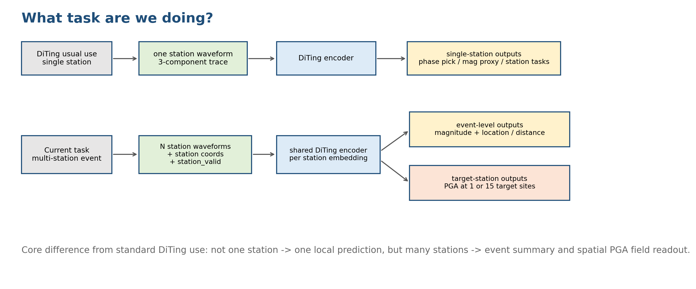

## Slide 4：传统 GMPE 与波形驱动模型

- GMPE 以震级、距离、断层和场地参数预测 PGA 中位数及不确定性。
- 优势是解释清楚、速度快、工程体系成熟。
- 局限是依赖先验震源估计，且复杂路径、方向性和局部场地效应常进入残差项。
- 多台站波形模型希望从实时波形和空间关系中直接学习目标位置 PGA。
- 版式角色：传统方法与研究动机。

## Slide 5：TEAM——任意台站集合到概率 PGA

- TEAM 输入任意数量、任意位置台站的原始强震波形和坐标。
- Transformer 将多台站信息映射到任意目标位置。
- 输出为 PGA 概率密度，再按 PGA 阈值和超越概率发布预警。
- 随机选择输入/目标台站和随机截断时间，使同一模型支持实时处理。
- 版式角色：论文方法。
- Required images：
  - TEAM Figure 3，PDF 第 4 页；严格输入资产；保留原始结构、阈值和 ShakeMap 信息。

    

## Slide 6：QuakeFormer——统一 forecasting、interpolation 与 EEW

- 用统一的 masked Transformer 表达地震动预测、插值和早期预警。
- 站点强度、波形和事件信息通过任务相关 mask 控制可见性。
- 同时编码绝对位置和基于 RoPE 的相对空间关系。
- forecasting/interpolation 预训练后再微调 EEW，使任务间共享震源、路径和场地信息。
- 版式角色：论文方法。
- Required images：
  - QuakeFormer Figure 2，PDF 第 7 页；严格输入资产；保留三类任务、token mask 与 self-attention mask。

    

## Slide 7：数据集与评估口径

- 日本 K-NET / KiK-net，共 1,001 个事件、52,102 条台站记录。
- 原始划分：699 train、101 validation、201 test 事件。
- 最新机制实验采用 512-event controlled setting；validation 口径保持独立评估。
- 指标：log PGA 空间中的 MAE、RMSE、Corr、R²、slope 和 bias。
- 报告必须区分 full-data system result 与 512-event mechanism diagnosis。
- 版式角色：数据与口径。
- Required images：
  - 数据统计图；严格输入资产。

    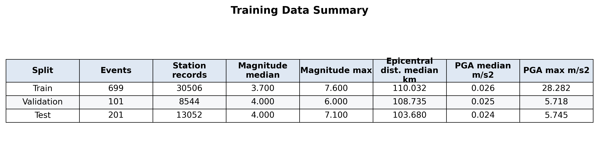

  - 日本事件与台站分布图；严格输入资产。

    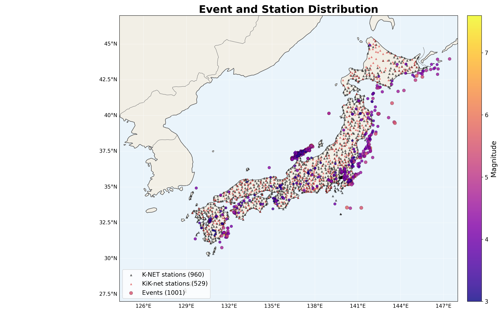

## Slide 8：当前模型结构

- DiTing encoder 提取单台站波形 token。
- station adapter 将预训练表征映射为多台站 station tokens。
- TEAM-style Transformer 建模台站集合。
- target-wise cross-attention 让每个 PGA 目标位置独立查询 station tokens。
- 最新分支加入 DPK eventness prior 与 temporal residual 路径。
- 版式角色：模型架构。
- Required images：
  - 当前模型结构图；严格输入资产；保留模块名称和连接。

    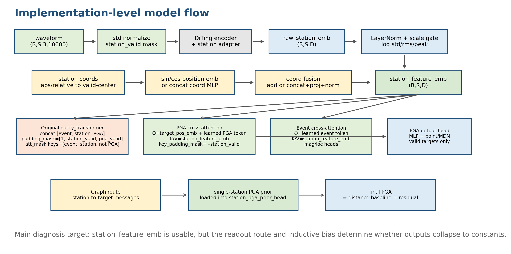

## Slide 9：训练策略与三类实验口径

- single-station pretrain：mag / epidist / PGA 多任务；full model 使用 PGA objective、target normalization 和可变输入台站数。
- 实时训练：随机输入时刻，覆盖 1、3、5、10、20、40、90 s。
- full-data experiment：回答系统在完整训练集上的最终泛化水平。
- 512-event overfit experiment：首先回答结构能否把训练集拟合好，再观察 train–validation gap；它不是最终系统成绩。
- time/station/strong-PGA 分桶：定位输入信息量和样本分布带来的瓶颈。
- station-roll mismatch 仅作为补充鲁棒性检查，与总体精度、分桶结果共同解释。
- 版式角色：训练与实验设计，明确不同数字不能混用。

## Slide 10：rt44–rt51 最新实验矩阵

- rt44–rt47：DPK event temporal residual，scale 0 / 2 / 4 / 8。
- rt48：station-pool + temporal residual。
- rt49：layerwise temporal readout。
- rt50：independent residual / uniform weighting control。
- rt51：station-roll training control。
- rt47 的 normal eval 文件不完整，涉及完整横向表时标记缺失，不用局部结果补齐。
- 版式角色：消融矩阵。

## Slide 11：历史 full-data 结果——先建立系统级锚点

- 历史模型使用完整的 699 train / 101 validation 事件；必须同时展示 train 与 validation：

  | Split | MAE | RMSE | Corr | R² | slope |
  | --- | ---: | ---: | ---: | ---: | ---: |
  | Train | 0.2234 | 0.3073 | 0.8750 | 0.7633 | 0.7634 |
  | Validation | 0.2966 | 0.3875 | 0.7278 | 0.5221 | 0.5931 |

- train→validation 的 MAE gap 为 0.0732，R² gap 为 0.2413；已有明显但尚可控的泛化差距。
- validation slope 仅为 0.5931，说明预测动态范围被压缩，强 PGA 仍容易低估。
- 残差标准差约为 0.704（train）和 0.892（validation），已换算到自然对数单位，便于后续与 QuakeFormer 对照。
- 这页是全量训练的经验锚点，不与 512-event overfit 结果混为同一训练口径。
- 版式角色：历史 full-data train/eval 成对结果。
- Required images：
  - 历史 full-data 指标图；严格输入资产。

    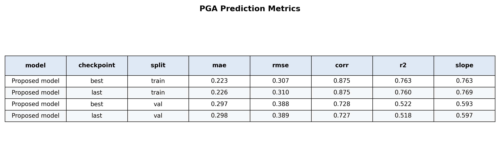

  - validation predicted-vs-true；严格输入资产。

    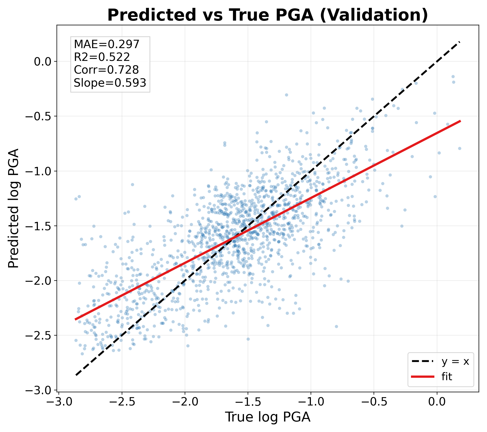

## Slide 12：512-event overfit——拟合能力强，泛化尚未同步

- last checkpoint 的 train/validation 成对结果如下；rt47 因 normal eval 不完整暂不列入：

  | Run | Train MAE | Train R² | Train slope | Val MAE | Val R² | Val slope |
  | --- | ---: | ---: | ---: | ---: | ---: | ---: |
  | rt44 | 0.0491 | 0.9573 | 0.9540 | 0.3080 | 0.4787 | 0.5382 |
  | rt45 | 0.0605 | 0.9520 | 0.9800 | 0.3054 | 0.4873 | 0.5905 |
  | rt46 | 0.0498 | 0.9587 | 0.9845 | 0.3034 | 0.4997 | 0.5913 |
  | rt48 | 0.0491 | 0.9551 | 0.9716 | **0.2968** | **0.5122** | 0.5820 |
  | rt49 | 0.0699 | 0.9565 | 1.0228 | 0.3018 | 0.5023 | **0.6205** |
  | rt50 | 0.0758 | 0.9375 | 0.9571 | 0.3060 | 0.4863 | 0.5969 |
  | rt51 | 0.0610 | 0.9504 | 0.9262 | 0.3025 | 0.5049 | 0.5446 |

- train MAE 已降至 0.049–0.076、R² 达到 0.938–0.959、slope 接近 1，证明结构和优化器具备充分拟合能力。
- validation MAE 仍集中在 0.297–0.308、R² 在 0.479–0.512；MAE gap 达 0.230–0.259。
- rt48 的 train/validation 残差标准差约为 0.267/0.898（自然对数单位），进一步显示瓶颈在泛化而非训练集拟合。
- DPK scale 0→4 有小幅收益，但没有“scale 越大越好”的证据；最新结构尚未刷新 full-data 系统锚点。
- 版式角色：512-event train/eval 配对结果；主结论是 capacity 与 generalization 的分离。
- Required images：
  - 新生成的 rt44–rt51 train-vs-validation MAE、R² 和 slope 配对图；严格数据资产。

## Slide 13：若使用全部数据训练，可以期待什么

- 已知“能力上限”：512-event train 的 MAE 为 0.049–0.076、R² 为 0.938–0.959；它证明模型容量足够，但不能直接外推成 held-out 成绩。
- 已知“经验锚点”：历史 full-data validation 为 MAE 0.2966、R² 0.5221、Corr 0.7278、slope 0.5931。
- 基于“半量数据已达到 MAE 0.2968”这一事实，完整数据训练的保守预期是回到或小幅超过历史锚点；实验规划区间可写为 **MAE 0.28–0.30、R² 0.52–0.60**，明确标注“预期区间，非观测结果”。
- 第一层验收线：同时满足 MAE < 0.2966、R² > 0.5221、slope > 0.5931；不能只以 train loss 更低作为成功。
- 第二层目标：缩小 train–validation gap、改善 strong-PGA 负偏和 unseen-station 泛化；全量数据更复杂，train error 高于 512-event overfit 是正常现象。
- 版式角色：用“容量上限—历史锚点—验收标准”约束全量训练预期，避免无依据承诺。
- Required images：
  - 新生成的三层标尺图：512-event train capacity、full-data observed anchor、full-data expected/acceptance region。

## Slide 14：实时输入窗口——多看几秒有多大收益

- 1 s 时 validation MAE 约为 0.38–0.40。
- 5 s 后多数模型降至约 0.28–0.30。
- 40 s 附近通常最好：rt46 为 0.2586，rt48 为 0.2589。
- 90 s 未稳定继续改善，说明时长收益存在饱和。
- 与 TEAM/QuakeFormer 一致：早期信息有限，性能随波形演化提升，但时效与精度必须折中。
- 版式角色：时间序列证据。
- Required images：
  - 新生成的 rt44–rt51 validation MAE–time 折线图；严格数据资产。

## Slide 15：输入台站数量——更多观测是否更好

- 单台站输入时 validation MAE 约为 0.45–0.57。
- 6–10 台站后误差明显下降，11–15 台站区间多数模型最好。
- 16+ 台站不再单调改善，台站空间分布和事件难度同样重要。
- 与 QuakeFormer 的 station-mask 结果方向一致：少量观测即可显著减少不确定性。
- 版式角色：台站数量分桶。
- Required images：
  - 新生成的输入台站数量分桶图；严格数据资产。

## Slide 16：案例 1——M4.7 事件的空间残差

- validation event 51（M4.7）；保持事件和 15 个目标不变，仅将输入台站数设为 3、5、8、12、16、25。
- 台站增加后，东侧输入台站的空间覆盖逐步扩展。
- 残差整体以负偏为主；更多台站主要减少负残差幅度，而非简单改变单个目标。
- 这是一例“总体持续受益、局部略有波动”的事件。
- 版式角色：案例 1 空间残差。
- Required images：
  - event 51 的六幅空间残差图；严格输入资产；原样保留六个面板、输入台站、事件星标、目标、色条、标签和地图关系。

    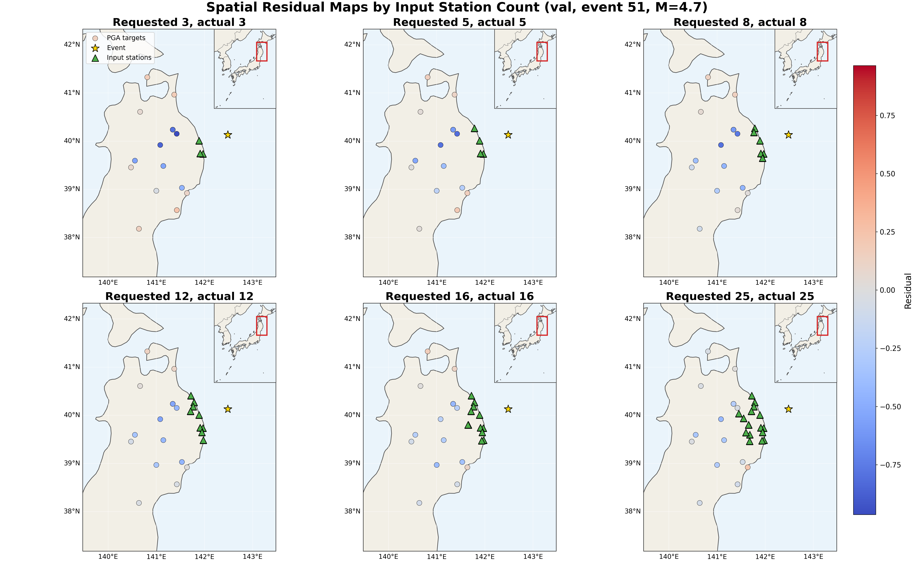

## Slide 17：案例 1——台站增加带来持续收益

- event 51（M4.7）在 3 / 5 / 8 / 12 / 16 / 25 台时，MAE 为 0.3498 / 0.2863 / 0.2937 / 0.2344 / 0.1952 / 0.1636。
- 3→25 台的 MAE 下降 0.1862，约 53%；5→8 台有轻微反弹，但总体趋势持续改善。
- bias 从 -0.2102 缓解到 -0.1308，说明低估减弱但没有消失。
- 右侧残差—震中距散点说明同一事件内不同目标仍存在显著空间异质性。
- 版式角色：案例 1 定量曲线。
- Required images：
  - event 51 的 station-count sweep 与 residual–distance 图；严格输入资产；原样保留折线、散点、轴、图例、标签和数值。

    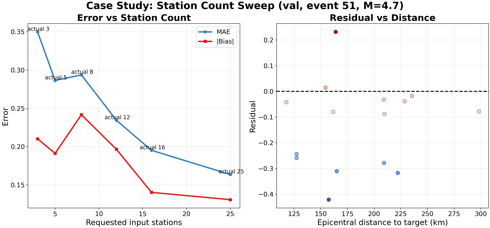

## Slide 18：案例 2——M5.4 事件的空间残差

- validation event 94（M5.4）；保持同一事件和目标集合，只改变输入台站数量。
- 从 3 台增至 8 台时，空间残差幅度明显收敛。
- 12–16 台后格局趋稳；增加到 25 台时部分远目标再次出现更强负残差。
- 这一事件体现“早期收益大、后期不单调”。
- 版式角色：案例 2 空间残差。
- Required images：
  - event 94 的六幅空间残差图；严格输入资产；原样保留六个面板、输入台站、事件星标、目标、色条、标签和地图关系。

    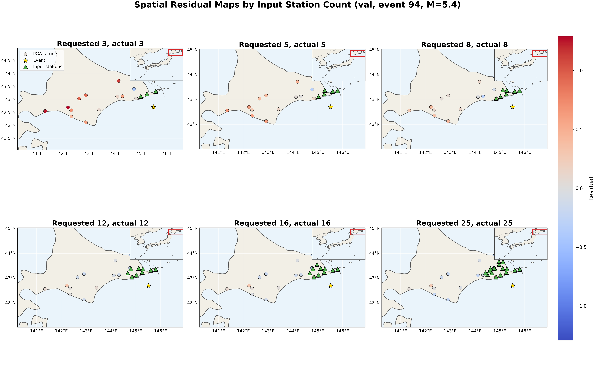

## Slide 19：案例 2——主要收益集中在 3→12 台

- event 94（M5.4）在 3 / 5 / 8 / 12 / 16 / 25 台时，MAE 为 0.6759 / 0.3888 / 0.2287 / 0.1603 / 0.1640 / 0.1969。
- 3→12 台的 MAE 下降 0.5157，约 76%；12 台后进入平台并在 25 台回升。
- bias 从 +0.6196 快速降至 +0.0156，随后在 16 / 25 台变为轻微负偏。
- 这一案例最清楚地展示了“更多台站有效，但并非越多越好”。
- 版式角色：案例 2 定量曲线。
- Required images：
  - event 94 的 station-count sweep 与 residual–distance 图；严格输入资产；原样保留折线、散点、轴、图例、标签和数值。

    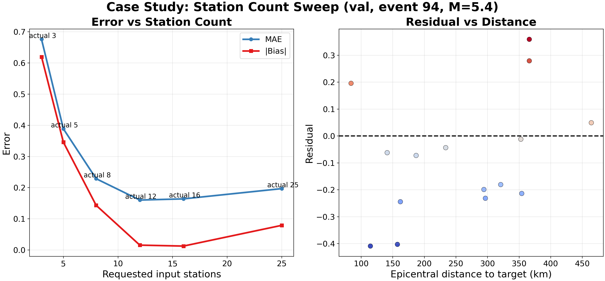

## Slide 20：案例 3——M5.0 事件的空间残差

- validation event 91（M5.0）；输入台站同样按 3、5、8、12、16、25 增加。
- 输入台站主要集中在事件西北方向，空间覆盖存在明显方向性。
- 目标残差正负并存；新增台站没有产生案例 2 那样快速、单调的收敛。
- 这一事件说明“台站位置与事件—目标几何”可比台站数量本身更重要。
- 版式角色：案例 3 空间残差。
- Required images：
  - event 91 的六幅空间残差图；严格输入资产；原样保留六个面板、输入台站、事件星标、目标、色条、标签和地图关系。

    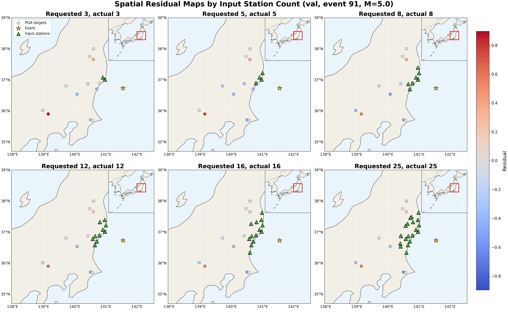

## Slide 21：案例 3——非单调但最终略有改善

- event 91（M5.0）在 3 / 5 / 8 / 12 / 16 / 25 台时，MAE 为 0.2654 / 0.3091 / 0.2782 / 0.2282 / 0.2329 / 0.2160。
- 3→5 台反而变差；12 台后变化较小，25 台相对 3 台仅下降 0.0495，约 19%。
- bias 在 -0.0164 至 -0.1138 之间波动，新增台站并未稳定消除低估。
- 三个案例共同证明：台站数量的平均收益真实存在，但事件级响应高度异质。
- 版式角色：案例 3 定量曲线。
- Required images：
  - event 91 的 station-count sweep 与 residual–distance 图；严格输入资产；原样保留折线、散点、轴、图例、标签和数值。

    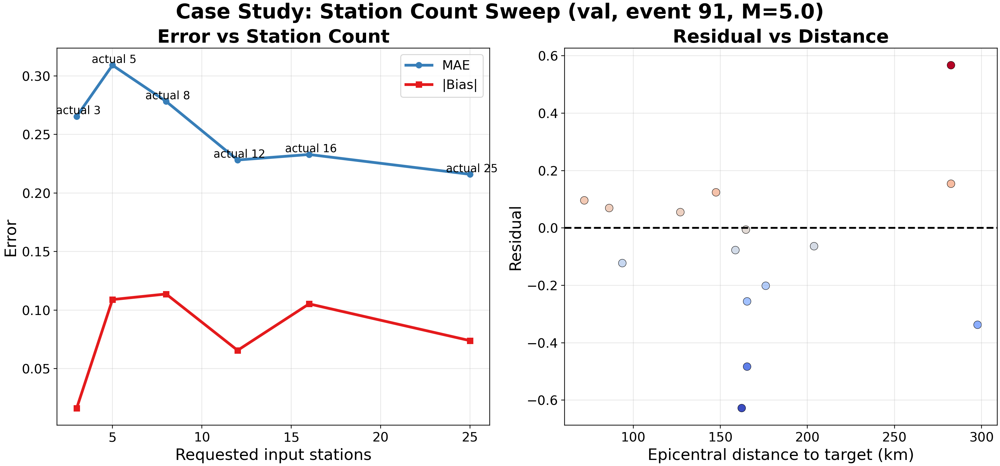

## Slide 22：震中距变化——中距离最好，远距离退化

- historical full-data best validation 的震中距分桶结果：

  | 震中距 | 目标数 | MAE | Bias | Corr |
  | --- | ---: | ---: | ---: | ---: |
  | 0–50 km | 415 | 0.3258 | -0.1082 | 0.6538 |
  | 50–100 km | 377 | 0.2929 | -0.0028 | 0.7042 |
  | 100–200 km | 475 | **0.2670** | +0.0578 | **0.7359** |
  | 200–400 km | 113 | 0.3067 | +0.1420 | 0.6700 |
  | 400–800 km | 13 | **0.4633** | +0.3432 | 0.4894 |

- 100–200 km 误差最低；200 km 后逐步变差。
- bias 从近距离负偏转为远距离正偏，说明距离相关校准仍有结构性问题。
- 400–800 km 只有 13 个目标，退化方向明确，但数值不宜过度外推。
- 版式角色：震中距分桶证据。
- Required images：
  - validation MAE 随震中距变化图；严格输入资产；原样保留分桶、曲线、坐标轴、标签和数值关系。

    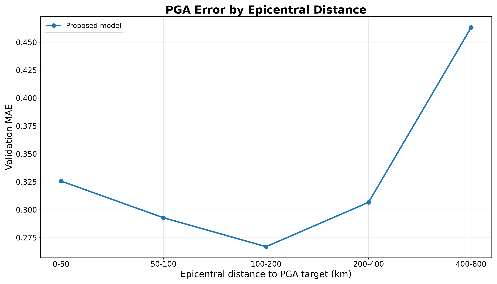

## Slide 23：空间与强弱 PGA 误差结构

- 弱 PGA 存在正偏，强 PGA 仍系统性低估。
- rt48 evaluator 中 strong subset MAE 为 0.3359、bias 为 -0.2778。
- 未触发目标、较长 lead time 和早期 1–3 s 更困难。
- 这一现象与 TEAM 的高 PGA 阈值退化、QuakeFormer 的近震源低估一致。
- 说明稀有强震样本和动态范围压缩仍是跨模型共同瓶颈。
- 版式角色：误差分解。
- Required images：
  - 历史 PGA 强度分桶图；严格输入资产。

    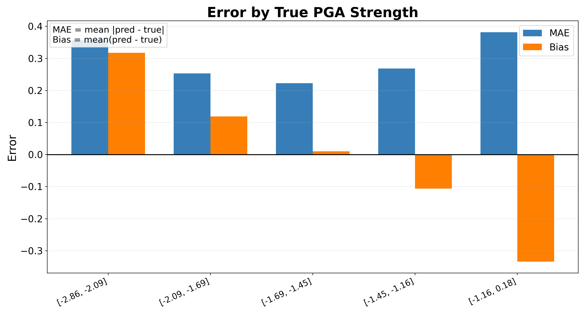

  - 新生成的 rt48 target-type / lead-time / strong-weak 诊断图；严格数据资产。

## Slide 24：台站对应关系——验证集影响稳定但较小

- 在同一事件内滚动打乱 waveform–station 对应，其余评估流程不变。
- mixed-source 7 个 run 的平均 MAE 增量：train +0.1114，validation +0.0122。
- KNET-only 8 个 run 的平均 MAE 增量：train +0.0988，validation +0.0115；8/8 的 validation MAE 变差，7/8 的事件 bootstrap 区间排除 0。
- KNET-only validation R² 平均下降 0.0433；strong-PGA bias 从 -0.2677 加深至 -0.3049。
- 结果表明模型确实利用正确对应关系，但跨事件验证影响远小于训练集影响，主要矛盾仍是 generalization gap。
- rt51 的 station-roll training control 仍为 validation MAE +0.0150、R² -0.0573，没有改善这种鲁棒性。
- 版式角色：mixed-source 与 KNET-only 的配对鲁棒性证据。
- Required images：
  - 新生成的 mixed-source / KNET-only normal→roll MAE 增量与 KNET-only R²、bias 变化图；严格数据资产。

## Slide 25：文献与本项目的数值对比——显式区分 train / held-out

- TEAM 论文仅公开日本 test 阈值结果，没有 train 行；本项目 rt48 固定 20 s 同时列 train 与 validation，以展示容量—泛化差距。
- 本项目 F1 在 train / validation 各自选择最佳 score cutoff，PR-AUC 为阈值无关排序指标；train 行仅表示拟合容量。

  | PGA 阈值 | TEAM test F1 / PR-AUC | 本项目 train F1 / PR-AUC | 本项目 validation F1 / PR-AUC |
  | --- | ---: | ---: | ---: |
  | 1%g | 0.730 / 0.820 | 0.965 / 0.995 | 0.620 / 0.642 |
  | 2%g | 0.690 / 0.760 | 0.952 / 0.985 | 0.545 / 0.536 |
  | 5%g | 0.630 / 0.680 | 0.932 / 0.985 | 0.438 / 0.372 |

- 本项目 train 正例数为 543 / 196 / 49，validation 为 125 / 55 / 13；train 接近饱和而 validation 明显下降。
- QuakeFormer 的 seen / unseen 是两种 held-out station 条件，并非 train / validation；本项目 train 行同样只作容量参照。

  | 模型/划分 | R² | 残差标准差 σ |
  | --- | ---: | ---: |
  | QuakeFormer forecasting, seen | ≈0.917 | 0.57 |
  | QuakeFormer forecasting, unseen | ≈0.837 | 0.75 |
  | 本项目 historical full-data validation | 0.522 | 0.892 |
  | 本项目 rt48 validation | 0.512 | 0.898 |
  | 本项目 rt48 train（仅表征拟合容量） | 0.955 | 0.267 |

- QuakeFormer 的 held-out R² 和残差离散度明显更好，但 seen/unseen station 仍有差距。
- σ 统一写为自然对数单位；QuakeFormer R² 是 Figure 3 读图近似值。
- 必须放置醒目标注：TEAM 是概率预警随时间评估，本项目是固定 20 s 点预测；QuakeFormer 数据规模约 20 万事件、400 万条记录且划分不同，因此数字用于量级和差距定位，不构成排行榜。
- 可得出的稳健结论：我们的训练容量已不弱，但 held-out 泛化、强 PGA、未见台站评估、概率输出和数据规模仍是主要差距。
- 版式角色：双栏定量对比，数值与口径说明同屏。

## Slide 26：KNET-only 512-event overfit——train 与 validation 成对

- 目的：去除 K-NET / KiK-net、地表 / 井下传感器混合造成的域差异。
- `chaosuan_res` 已包含 rt44–rt51 全部 KNET-only last eval；每个 run 必须同时列 train 与 validation：

  | Run | Train MAE | Train R² | Train slope | Val MAE | Val R² | Val slope |
  | --- | ---: | ---: | ---: | ---: | ---: | ---: |
  | rt44 | 0.0540 | 0.9512 | 0.9896 | 0.2976 | 0.4552 | 0.5617 |
  | rt45 | 0.0994 | 0.9142 | 0.9541 | 0.3092 | 0.4264 | 0.5554 |
  | rt46 | 0.0733 | 0.9319 | 0.9515 | 0.2971 | 0.4579 | 0.5471 |
  | rt47 | 0.0490 | 0.9535 | 0.9691 | 0.2998 | 0.4511 | 0.5487 |
  | rt48 | 0.0498 | 0.9549 | 0.9839 | **0.2877** | 0.4817 | **0.5723** |
  | rt49 | 0.0552 | **0.9588** | 0.9336 | 0.2881 | **0.4873** | 0.5362 |
  | rt50 | 0.0618 | 0.9424 | 0.9081 | 0.2991 | 0.4502 | 0.5208 |
  | rt51 | 0.0742 | 0.9324 | 0.8809 | 0.2968 | 0.4540 | 0.5192 |

- 8-run 均值：train MAE / R² / slope = 0.0646 / 0.9424 / 0.9464；validation = 0.2969 / 0.4580 / 0.5452。
- validation−train MAE gap 平均 0.2323，单 run 范围约 0.210–0.251。
- rt48 的 validation MAE 最低，rt49 的 R² 最高；两者在当前样本量下应视为并列候选，不宜宣称单一最优。
- 版式角色：KNET-only 512-event 的 train / validation 成对容量证据。

## Slide 27：KNET-only 受控比较——共同目标与校准

- 7 个表面可比 run 的非配对均值为 mixed-source 0.3034 → KNET-only 0.2965，表面改善 0.0069，6/7 run 变好；但两边 validation target 分别为 4512 与 4082，口径不同。
- 固定到同一 event / time / target coordinate 后仅有 2716 个共同目标，KNET−mixed 的平均 MAE 差为 +0.0001，事件 bootstrap 95% CI [-0.0124, +0.0124]；没有证据证明仅筛为 KNET 就改善了泛化。
- KNET-only strong-PGA bias 均值仍为 -0.2677；网络筛选没有解决强 PGA 低估。
- 不确定性仍明显过度自信：平均 1σ / 2σ 覆盖率仅 13.8% / 27.0%；平均 Brier 0.2265，高于正例率常数基线 0.2112。
- 版式角色：共同目标配对检验、强 PGA 与校准缺口。

## Slide 28：阶段结论与下一步

- 多台站 PGA 模型已经达到约 0.30 validation MAE，更多台站和更长波形总体有效。
- 三个具体事件显示收益形态不同：M4.7 总体持续改善，M5.4 在 12 台后反弹，M5.0 非单调且最终收益较小；空间覆盖比数量本身更关键。
- 震中距 100–200 km 的 MAE 最低为 0.2670，400–800 km 升至 0.4633，但该桶只有 13 个目标。
- 512-event overfit 中 train R² 达 0.94–0.96、slope 接近 1，证明模型容量和优化没有卡住；validation 仍处于 R² 约 0.48–0.51，主要矛盾是泛化差距。
- KNET-only 自身结果中 rt48 / rt49 领先，但 2716 个共同目标上的 mixed→KNET 差异为 +0.0001，尚无配对证据支持网络筛选带来泛化收益。
- station-roll 在 KNET-only 8/8 run 上使 validation MAE 变差，平均 +0.0115；rt51 control 没有提升鲁棒性。
- 全量训练的首要目标是稳定超过历史锚点 MAE 0.2966 / R² 0.5221，同时改善 slope 和 strong-PGA 负偏。
- TEAM 与 QuakeFormer 均表明时间演化、台站观测和空间编码有效，也共同暴露强震、超大事件或未见位置上的性能下降。
- 优先采用固定共同目标的 2×2 controlled design，推进 rt48 / rt49 / rt46 full-data 复验，并增加多个 mismatch seed。
- 同步重校准预测方差与阈值概率，改善 strong-PGA 负偏；随后再评估 masked pretraining、绝对+相对位置编码和合成强震数据。
- 版式角色：结论与行动项。

## Slide 29：参考文献

- Münchmeyer, J. et al. (2021). *The Transformer Earthquake Alerting Model: A New Versatile Approach to Earthquake Early Warning*. GJI / arXiv:2009.06316.
- Feng, Y., Zhu, W. & Lu, X. (2024). *QuakeFormer: A Uniform Approach to Earthquake Ground Motion Prediction Using Masked Transformers*. arXiv:2412.00815.
- Boore, D. M. & Atkinson, G. M. (2008). Ground-motion prediction equations for PGA, PGV and PSA.
- Aoi, S., Kunugi, T. & Fujiwara, H. (2004). Strong-motion seismograph network operated by NIED: K-NET and KiK-net.
- 版式角色：参考文献。

## 确认记录

- 原 21 页结构、科研答辩视觉方向和 Slide 12 样稿已由用户确认。
- 2026-07-26 第二次修订为 29 页：补齐 event 51 / 94 / 91 三个成套案例和震中距分桶结果。
- 第 13 页预期区间明确标注为“预期区间，非观测结果”。
- 第 24 页删除原底部说明文字，并保留 mixed-source / KNET-only 完整 station-roll 证据。
- 第 25 页补入本项目 TEAM-style train / validation，对 TEAM test 与 QuakeFormer seen / unseen 明确标注口径。
- 第 26 页采用 `chaosuan_res` 中 rt44–rt51 完整 KNET-only last eval，逐 run 同时列 train / validation；共同目标检验与校准移至第 27 页。
